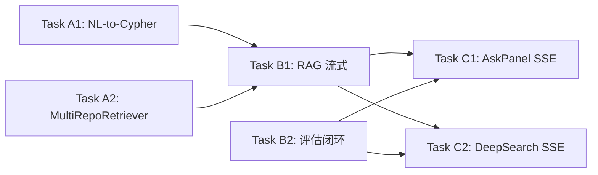

# Phase 8: 引擎层升级 + 前端 SSE 适配

> **日期:** 2026-05-01  
> **前置:** Phase 7 完成（LLM 统一 + RAG 单内核 + Code Review 修复 + 已知限制修复）  
> **组织:** 3 Sprints（A → B → C）  
> **状态:** Implemented

---

## 0. 当前架构快照

```
API 端点（不变）    编排层（保留差异化）       统一内核           检索层
───────────      ─────────────────      ────────          ───────
/deep-search  →  DeepSearchEngine     →  IterativeRAG  →  HybridGraphRetriever
/ask/stream   →  WikiAskService       →  IterativeRAG  →    ├─ HybridQueryService
/wiki/research → DeepResearchService  →  IterativeRAG  →    └─ GraphQueryService(entity)
MCP tool      →  WikiMCPHandler       →  IterativeRAG  →  WikiRetriever (bootstrap)
```

### LLM Port

```python
class LLMPort(Protocol):
    async def generate(prompt, system, *, model, max_tokens, reasoning_effort) -> str
    async def complete(messages, **kwargs) -> str
    async def complete_stream(messages, **kwargs) -> AsyncIterator[str]
```

### IterativeRAGEngine 状态机（当前）

```
initial_search → generate_draft → [route_after_draft]
                                    ├─ finalize (conf≥0.85 / max_rounds / no queries)
                                    ├─ evaluate (round≥3 AND conf<0.7)
                                    │    └─ [route_after_evaluate]
                                    │         ├─ finalize (is_complete)
                                    │         └─ plan
                                    ├─ plan (round≥2)
                                    │    └─ dynamic_retrieve → generate_draft
                                    └─ dynamic_retrieve (round 1)
                                         └─ generate_draft
```

### HybridGraphRetriever（当前 graph leg）

```python
# 智能实体提取（PascalCase/camelCase/snake_case）
terms = extract_entity_candidates(query, max_lookups=3)
for term in terms:
    result = await self._graph.find_entity(term)
    # Function/Class → find_call_chain(depth=1)
```

### NLCypherService（已实现，未接入生产路径）

```python
class NLCypherService:
    def __init__(self, store: FalkorDBStore, llm: LLMProvider, *, max_retries=2)
    async def query(question, *, repository=None) -> dict  # 含 cypher, results, total
```

### 前端 SSE 现状

| 路径 | 协议 | 已处理事件类型 |
|------|------|-------------|
| `/wiki/ask/stream` | `ReadableStream` + JSON `type` | `token`, `sources`, `done`, `error`, `rag_progress` |
| `/deep-search/stream` | `event:` + `data:` | `plan`, `progress`, `search_done`, `synthesis`, `conclusion`, `error` |

- `RagTimeline`（内联于 `AskPanel.tsx`）渲染 `rag_progress` → 仅 styling `searching`/`draft`/`refining`/`done`
- `DeepResearchTimeline` 渲染深搜 stages → `KNOWN_DEEP_SEARCH_EVENTS` 白名单
- **`planning`/`evaluating` 后端已发出但前端未处理**

---

## Sprint A: 检索层增强

### Task A1: NL-to-Cypher 接入 HybridGraphRetriever

**目标:** 将已实现的 `NLCypherService` 接入 `HybridGraphRetriever` 的 graph leg，让自然语言问题可直接转为 Cypher 查询图数据库，获得结构化的图查询结果作为 RAG 上下文。

**设计决策:** 当 LLM 不可用时搜索整体不可用，不需要 fallback 到原始实体查找。原有 `find_entity + find_call_chain` 逻辑保留为 NL-to-Cypher 之外的补充路径。

**改动范围:**

| 文件 | 变更 |
|------|------|
| `wiki/rag/hybrid_graph_retriever.py` | 构造函数增加 `nl_cypher: NLCypherService \| None`；graph leg 优先走 NL-to-Cypher；原 entity 逻辑保留 |
| `services/kb_service.py` | 组装 `NLCypherService` 并注入到 `HybridGraphRetriever` |
| `wiki/bootstrap.py` | WikiRetriever 路径不受影响 |

**接口设计:**

```python
class HybridGraphRetriever:
    def __init__(
        self,
        hybrid_service: Any,
        graph_service: Any | None = None,
        nl_cypher: NLCypherService | None = None,  # NEW
    ) -> None:
        self._hybrid = hybrid_service
        self._graph = graph_service
        self._nl_cypher = nl_cypher

    async def _append_graph_chunks(self, query: str, chunks: list[Chunk]) -> None:
        # 路径 1: NL-to-Cypher（优先）
        if self._nl_cypher is not None:
            try:
                result = await self._nl_cypher.query(query)
                if result.get("results"):
                    for row in result["results"]:
                        chunks.append(Chunk(
                            content=_format_cypher_row(row),
                            source="graph_cypher",
                            title="graph_cypher",
                            relevance=0.6,
                        ))
                    return  # Cypher 成功，跳过 entity lookup
            except Exception:
                logger.warning("nl_cypher_query_failed", exc_info=True)
                # NL-to-Cypher 失败 → fall through to entity lookup

        # 路径 2: 原始 entity 查找（补充/兜底）
        # 保留现有 find_entity + find_call_chain 逻辑不变
        if self._graph is not None and hasattr(self._graph, "find_entity"):
            # ... 现有逻辑 ...
```

**关键细节:**
- `NLCypherService` 已内置 read-only 校验 + retry 机制，安全性已保障
- Cypher 结果行通过 `_format_cypher_row(row: dict) -> str` 转为可读文本（格式: `"[Type] Name (file:line) - signature"`），作为 `Chunk.content`
- `source="graph_cypher"` 区分来源，前端可按需展示
- Cypher 生成或执行失败时 fall through 到 entity lookup，确保降级可用
- `NLCypherService` 使用 `LLMProvider`（非 `LLMPort`），这是正确的——它是 query 层组件，直接使用基础设施层接口

### Task A2: 跨仓库语义检索（MultiRepoRetriever）

**目标:** 实现 `MultiRepoRetriever`，当 `scope.scope_type == "global"` 且多个仓库存在时，并行查询所有仓库并合并结果。

**设计决策:** 复用 `HybridQueryService.search_multi_repo`（已实现），无需重复实现并行查询逻辑。

**改动范围:**

| 文件 | 变更 |
|------|------|
| `wiki/rag/multi_repo_retriever.py` | 新建，包装 `HybridQueryService.search_multi_repo` |
| `services/kb_service.py` | global scope 时使用 `MultiRepoRetriever` 替代 `HybridGraphRetriever` |
| `wiki/rag/__init__.py` | 导出 `MultiRepoRetriever` |

**接口设计:**

```python
class MultiRepoRetriever:
    """Global-scope retriever: parallel search across all repositories."""

    def __init__(
        self,
        hybrid_service: HybridQueryService,
        repo_registry: Any,
        graph_service: Any | None = None,
        nl_cypher: NLCypherService | None = None,
    ) -> None:
        self._hybrid = hybrid_service
        self._registry = repo_registry
        self._graph = graph_service
        self._nl_cypher = nl_cypher

    async def retrieve(
        self,
        queries: list[str],
        scope: RetrievalScope,
        *,
        limit: int = 10,
        exclude_ids: set[str] | None = None,
    ) -> list[Chunk]:
        repos = await self._registry.list_repositories()
        if not repos or scope.repository:
            # 单仓库 or 无仓库：委托给单仓库路径
            return await self._single_repo_retrieve(queries, scope, limit=limit)

        combined_query = " ".join(queries)
        result = await self._hybrid.search_multi_repo(
            combined_query,
            repos,
            limit=limit,
        )
        chunks = _hybrid_result_to_chunks(result)

        # graph leg 补充
        if self._nl_cypher is not None:
            await self._append_cypher_chunks(combined_query, chunks)
        return chunks[:limit]
```

**关键细节:**
- `repo_registry` 需提供 `list_repositories() -> list[str]` 方法（需确认现有接口，不存在则新增）
- `search_multi_repo` 已处理并行查询 + 去重 + RRF 融合
- graph leg 复用 NL-to-Cypher（Task A1）
- `_hybrid_result_to_chunks` 将 `HybridResult` 的 `semantic_matches` 转为 `Chunk` 列表
- 单仓库时委托给内部 `HybridGraphRetriever`（组合模式，非替代）

---

## Sprint B: 引擎层升级

### Task B1: RAG 真流式输出

**目标:** `IterativeRAGEngine` 新增 `arun_stream` 方法，利用 LangGraph `astream` API 实现节点级实时 SSE 推送，在 `generate_draft` 节点内部直接使用 `LLMPort.complete_stream` 实现 token 级流式输出。

**设计决策:** 现代 LLM 均支持 streaming，直接使用 `complete_stream` 获取逐 token 输出。

**改动范围:**

| 文件 | 变更 |
|------|------|
| `wiki/rag/engine.py` | 新增 `arun_stream` async generator |
| `wiki/ask.py` | `ask_stream` 消费 `arun_stream` 实现实时 token 推送 |
| `query/deep_search.py` | `search_stream` 消费 `arun_stream` |

**接口设计:**

```python
# engine.py
class IterativeRAGEngine:
    # 保留 arun() 作为批量模式

    async def arun_stream(
        self,
        *,
        question: str,
        scope: RetrievalScope,
        max_rounds: int = 7,
    ) -> AsyncIterator[dict[str, Any]]:
        """真流式执行：节点级 SSE + token 级流式."""
        init = self._build_init_state(question, scope, max_rounds)

        # 使用 LangGraph astream (stream_mode="values") 获取完整 state snapshot
        prev_events_len = 0
        async for state_update in self._graph.astream(init, stream_mode="values"):
            # 1. yield 新增的 SSE 事件（searching/planning/evaluating/refining/done）
            events = state_update.get("sse_events", [])
            for ev in events[prev_events_len:]:
                yield {"type": "sse", "data": ev}
            prev_events_len = len(events)

            # 2. yield draft 内容更新
            if "current_draft" in state_update:
                yield {
                    "type": "draft",
                    "data": {"content": state_update["current_draft"]},
                }

        # 最终 yield done 信号
        yield {"type": "done", "data": {
            "confidence": state_update.get("confidence", 0.0),
            "total_rounds": state_update.get("round", 1),
        }}
```

**generate_draft 节点流式化:**

```python
# 在 generate_draft 节点内部使用 complete_stream
async def generate_draft(state: RAGState) -> dict[str, Any]:
    # ... prompt 构建 ...
    
    # 流式收集 LLM 输出
    raw_chunks: list[str] = []
    async for chunk in gen_llm.complete_stream(
        [{"role": "user", "content": prompt}]
    ):
        raw_chunks.append(chunk)
    raw = "".join(raw_chunks)
    
    # ... 解析 JSON 反射 ...
```

**调用方适配（WikiAskService）:**

```python
# ask.py - ask_stream 方法
async def ask_stream(self, ...):
    # ...
    async for event in self._rag_engine.arun_stream(
        question=question, scope=scope_obj, max_rounds=5,
    ):
        if event["type"] == "sse":
            yield {"event": "rag-progress", "data": event["data"]}
        elif event["type"] == "draft":
            content = event["data"]["content"]
            delta = content[len(acc):]
            acc = content
            if delta:
                yield {"event": "wiki-answer", "data": {"content": acc, "delta": delta}}
        elif event["type"] == "done":
            # ... yield sources + complete ...
```

**关键细节:**
- `arun()` 保留不变，MCP 和非流式场景继续使用
- `arun_stream` 利用 LangGraph 的 `astream()` API（yields intermediate state snapshots after each node）
- `generate_draft` 节点内部使用 `complete_stream` 流式收集，但节点仍返回完整结果（LangGraph 节点返回值是 state patch）
- 上层 `ask_stream` / `search_stream` 通过 diff 机制实现 delta 推送

### Task B2: 质量评估闭环

**目标:** `evaluate` 节点的 `suggestions` 字段反馈到 `plan` 节点，让 plan 生成的 sub-queries 更有针对性。

**改动范围:**

| 文件 | 变更 |
|------|------|
| `wiki/rag/engine.py` | `RAGState` 新增 `eval_suggestions`；evaluate 写入；plan 读取 |

**接口设计:**

```python
class RAGState(TypedDict, total=False):
    # ... existing fields ...
    eval_suggestions: list[str]  # NEW: evaluate 反馈的改进建议

# evaluate 节点修改
async def evaluate(state: RAGState) -> dict[str, Any]:
    # ... 现有逻辑 ...
    return {
        "next_queries": nq,
        "eval_suggestions": suggestions,  # NEW: 传递给 plan
        "sse_events": ev,
    }

# plan 节点修改
async def plan(state: RAGState) -> dict[str, Any]:
    # ... existing ...
    eval_suggestions = state.get("eval_suggestions", [])
    suggestions_text = "\n".join(f"- {s}" for s in eval_suggestions) if eval_suggestions else ""
    
    prompt = (
        f"Original question:\n{q}\n\n"
        f"Information gaps:\n{gaps_text}\n\n"
        + (f"Previous evaluation feedback:\n{suggestions_text}\n\n" if suggestions_text else "")
        + "Decompose into 2-4 precise sub-queries to fill these gaps. "
        'Reply with ONLY valid JSON: {"sub_queries": ["query1", "query2", ...]}'
    )
    # ...
```

**关键细节:**
- 最小改动：仅新增一个 state 字段 + 两处读写
- plan 节点 prompt 中 suggestions 为可选段落，不影响无 evaluate 的正常路径
- 不改变状态机路由逻辑

---

## Sprint C: 前端 SSE 适配

### Task C1: AskPanel 新事件支持

**目标:** `useWikiAsk.ts` 和 `RagTimeline`（AskPanel.tsx 内联组件）支持 `planning`/`evaluating` 新事件类型。

**改动范围:**

| 文件 | 变更 |
|------|------|
| `dashboard/src/hooks/useWikiAsk.ts` | `consumeWikiAskStreamSseV2` 中 `rag_progress` 已处理，确认 `planning`/`evaluating` 作为 sub-type 传入 `ragStages` |
| `dashboard/src/components/wiki/AskPanel.tsx` | `RagTimeline` 为 `planning`/`evaluating` 添加样式和文案 |
| `dashboard/src/hooks/wikiTypes.ts` | 类型定义新增 `planning`/`evaluating` |

**详细设计:**

```typescript
// AskPanel.tsx - RagTimeline 组件扩展
const stageStyles: Record<string, { color: string; label: string }> = {
  searching: { color: "text-blue-500", label: "搜索中" },
  draft:     { color: "text-green-500", label: "生成草稿" },
  planning:  { color: "text-purple-500", label: "规划子查询" },  // NEW
  evaluating:{ color: "text-orange-500", label: "质量评估" },    // NEW
  refining:  { color: "text-yellow-500", label: "细化检索" },
  done:      { color: "text-emerald-600", label: "完成" },
};

// planning 事件额外展示 sub_queries
{stage.type === "planning" && stage.sub_queries && (
  <ul className="ml-4 text-xs text-gray-500">
    {stage.sub_queries.map((q, i) => <li key={i}>• {q}</li>)}
  </ul>
)}

// evaluating 事件额外展示 score
{stage.type === "evaluating" && (
  <span className="text-xs text-gray-500 ml-2">
    评分: {(stage.score * 100).toFixed(0)}%
  </span>
)}
```

**关键细节:**
- 后端 `rag_sse_append` 发出的事件 `type` 为 `planning`/`evaluating`
- 前端 `consumeWikiAskStreamSseV2` 对 `rag_progress` 事件直接推入 `ragStages`，不需改消费逻辑
- 仅需在 `RagTimeline` 渲染层添加对应样式

### Task C2: DeepSearch stream 新事件 + 结构化结果

**目标:** 
1. `useDeepSearchStream.ts` 的 `KNOWN_DEEP_SEARCH_EVENTS` 白名单增加 `planning`/`evaluating`
2. `DeepSearchSection.tsx` 流式模式下也渲染 `business_flows`/`code_locations`

**改动范围:**

| 文件 | 变更 |
|------|------|
| `dashboard/src/hooks/useDeepSearchStream.ts` | 白名单 + 状态处理 |
| `dashboard/src/components/DeepSearchSection.tsx` | stream conclusion 渲染结构化数据 |
| `dashboard/src/components/DeepResearchTimeline.tsx` | `StageEvent` 类型扩展 |

**详细设计:**

```typescript
// useDeepSearchStream.ts
const KNOWN_DEEP_SEARCH_EVENTS = new Set<StageEvent["type"]>([
  "plan", "progress", "search_done", "synthesis", "conclusion", "error",
  "planning",    // NEW
  "evaluating",  // NEW
]);

// DeepResearchTimeline.tsx - StageEvent 类型扩展
type StageEvent = 
  | { type: "plan"; data: { intent: string; sub_queries: string[] } }
  | { type: "progress"; data: Record<string, unknown> }
  | { type: "planning"; data: { round: number; sub_queries: string[] } }   // NEW
  | { type: "evaluating"; data: { round: number; score: number; suggestions: string[] } } // NEW
  | { type: "search_done"; data: Record<string, unknown> }
  | { type: "synthesis"; data: Record<string, unknown> }
  | { type: "conclusion"; data: ConclusionData }
  | { type: "error"; data: { error: string } };

// DeepSearchSection.tsx - stream conclusion 渲染
// 当前非 stream 模式已渲染 business_flows/code_locations
// stream 模式的 conclusion.data 也包含这些字段，需添加渲染
{conclusion?.business_flows?.length > 0 && (
  <BusinessFlowsSection flows={conclusion.business_flows} />
)}
{conclusion?.code_locations?.length > 0 && (
  <CodeLocationsSection locations={conclusion.code_locations} />
)}
```

**关键细节:**
- 后端 `DeepSearchEngine.search_stream` 的 `conclusion` 事件 `data` 已包含 `business_flows` 和 `code_locations`
- 前端仅需在 stream 模式渲染路径中添加这些字段的展示
- `DeepResearchTimeline` 为 `planning`/`evaluating` 添加对应 i18n label 和样式

---

## 依赖关系



- Sprint A（A1, A2）可并行
- Sprint B（B1, B2）可并行，但依赖 Sprint A 完成
- Sprint C（C1, C2）可并行，依赖 Sprint B 完成

---

## 非目标（Not In Scope）

- 前端 EventSource wiki 事件（`useWikiEvents.ts`）不在本次范围
- `compose_concurrency` 模块导入时固定问题（低优先级，后续处理）
- 认证/权限相关变更
- API 端点 path 变更

---

## 自审清单

- [x] NLCypherService 已有 read-only 校验，不引入写操作安全风险
- [x] `search_multi_repo` 已实现并行 + 去重 + RRF，不重复造轮子
- [x] LLMPort.complete_stream 已在 protocol 中定义，不需新增接口
- [x] 前端修改范围精确：仅涉及白名单扩展 + 样式扩展 + 已有数据字段渲染
- [x] arun() 保留不变，向后兼容
- [x] NL-to-Cypher 失败 fall through 到 entity lookup，不破坏现有功能
- [x] 用户反馈已整合：无 LLM 不可用时的 fallback（Task A1）；直接使用 complete_stream（Task B1）
