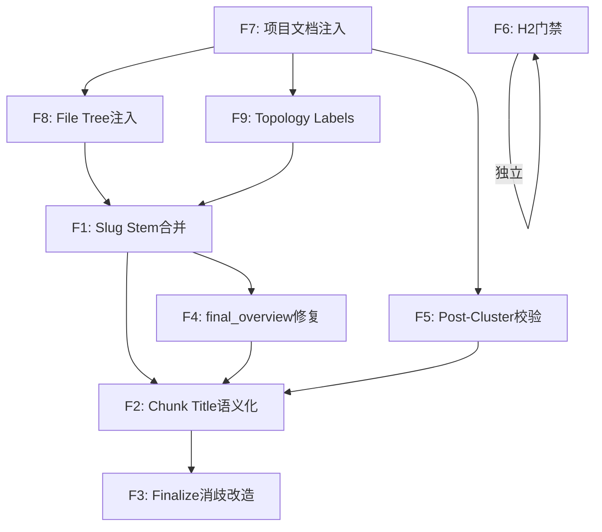

# Wiki Quality Repair V14 — 域稳定与内容结构根治

**Created:** 2026-06-01
**Audit Basis:** V28 审计 (V13 部署后, 73页/28域/45topic)
**Target:** V28 综合评分 5.9/10 → 7.5/10+, 全部 P0 清零
**Strategy:** 单次发布, 重新生成 wiki 后审计验证

---

## 1. Executive Summary

V13 部署后, Wiki 在**正文质量门禁**上已完全稳定（幻觉 0, cn_ratio 达标, Part N/compound key 清零, stub 清零）。综合评分 5.9/10, 剩余瓶颈集中在：

1. **命名瓶颈**: 40% topic 使用 compound serial 格式 `中文名（domain-slug·专题·N）`
2. **域结构瓶颈**: 2 组域重复 + 2 处跨域错挂
3. **覆盖率瓶颈**: 11 域无 topic (60.7%), 单模块域 mechanical 不可拆

核心判断: 这三类问题**共享一个底层根因** — mechanical split 产生同名 topic → 消歧追加 slug → compound serial title。修复源头后, 消歧逻辑自然不再触发。

---

## 2. P0 问题清单与根因

### P0-1: Compound Serial Title (18/45 = 40%)

**表现:** `亲密关系核心服务（intimacy-task·专题·2）`

**根因链路:**
```
domain_doc_agent.py:940 _build_mechanical_topic_split
  → line 957: module_dicts = [{"name": m, "display_name": m}]  # raw模块名作为display_name
  → line 958: title = _extract_chunk_title(module_dicts, ...)
  → domain_doc_agent.py:273: 取最长module名
  → 多个chunk取到相同语义的标题（如都含Relation*→都derive为"关系核心服务"）
  → finalize.py:604 _deduplicate_exact_titles 检测重名
  → finalize.py:535 _disambiguation_parts level=2 → (domain, "专题", seq)
  → finalize.py:528 _title_with_suffix → "关系核心服务（domain-slug·专题·N）"
```

### P0-2: 域重复×2

**表现:** `relation-rank` + `relation-rank-service`, `quick-message` + `quick-message-service`

**根因链路:**
```
graph_domain_decompose.py:1040 _dedup_parallel_naming_results
  → LLM并行命名两个域得到相同slug
  → line 1048: slug碰撞 → line 1060: new_slug = f"{slug}-{suffix}"
  → suffix 从模块名截取 → 产生 "{base}-service" 变体
  → config: skip_llm_merge_when_corrector_enabled=True → 跳过LLM合并
  → 两个语义相同的域并存
```

### P0-3: 覆盖率 60.7% (11 域无 topic)

**根因链路:**
```
domain_doc_agent.py:895: overview_content = getattr(memory, "final_overview", None) or ""
  → memory.final_overview 从未被赋值 (dead code)
  → overview_len 永远=0
  → line 900: should_plan 仅靠 len(module_names) >= min_modules(=2)
  → 单模块域: should_plan=False → 直接跳过topic规划
  → 11域中约6域为单模块域
```

### P0-4: 跨域错挂×2

**根因:**
```
domain_semantic_clusterer.py:46 _prefix_from_camel
  → 取CamelCase第一段: RelationFamilyTaskService → "Relation"
  → 但该类实际属于 family 业务域
  → HAC聚类将其归入 relation-* 簇
  → 无 placement reparent 纠正
```

### P0-5: 3 Topic 仅 1 个 H2

**根因:** `quality_gate.py` 无 H2 数量下限, 长文通过字数门禁但结构检查缺失。

---

## 3. 修复方案设计

### F1: Slug Stem 合并 (P0-2)

**文件:** `wiki/nodes/graph_domain_decompose.py:1040`

**改动:** 在 `_dedup_parallel_naming_results` 中, 当 slug 碰撞时**合并而非分裂**:

```python
def _dedup_parallel_naming_results(results, existing_slugs):
    seen: set[str] = set(existing_slugs)
    merged_into: dict[int, int] = {}  # index → merge_target_index

    for i, result in enumerate(results):
        slug = result["slug"]
        if slug not in seen:
            seen.add(slug)
            continue
        # Find which earlier result owns this slug
        target_idx = next(
            (j for j, r in enumerate(results[:i]) if r["slug"] == slug),
            None,
        )
        if target_idx is not None:
            # Merge modules into target instead of creating new domain
            results[target_idx]["modules"].extend(result.get("modules", []))
            merged_into[i] = target_idx
            log.info("slug_collision_merged", slug=slug, merged_from=i, into=target_idx)
        else:
            # Collision with existing_slugs (from prior run) — use numeric suffix
            counter = 2
            while f"{slug}-{counter}" in seen:
                counter += 1
            result["slug"] = f"{slug}-{counter}"
            seen.add(result["slug"])

    # Remove merged entries
    return [r for i, r in enumerate(results) if i not in merged_into]
```

**额外:** 在合并后添加 stem 检测 — 如果 `slug_a` == `slug_b.removesuffix("-service")`, 合并到短 slug。

### F2: Mechanical Chunk Title 语义化 (P0-1 源头)

**文件:** `wiki/domain_doc_agent.py:940`

**改动:** `_build_mechanical_topic_split` 为每个 chunk 生成不同的 display_name, 避免多个 chunk 得到相同标题:

```python
def _build_mechanical_topic_split(self, module_names: list[str]) -> DomainTopicOutline | None:
    # ... existing chunk logic ...
    topics = []
    for i, chunk in enumerate(chunks):
        slug = _derive_slug_from_modules(chunk)
        # Generate distinct display_name per chunk using common prefix
        common_prefix = _common_camel_prefix(chunk)
        if common_prefix and common_prefix != self.domain_display_name:
            display_name = common_prefix
        else:
            display_name = chunk[0]  # use first module directly
        module_dicts = [{"name": m, "display_name": display_name} for m in chunk]
        title = _extract_chunk_title(module_dicts, self.domain_display_name, i)
        topics.append(OutlineTopicItem(title=title, modules=chunk, description="", slug=slug))
    # ...
```

新增辅助函数:
```python
def _common_camel_prefix(modules: list[str]) -> str:
    """Extract the longest common CamelCase prefix from a list of module names."""
    if not modules:
        return ""
    import re
    parts_list = [re.findall(r"[A-Z][a-z]*|[a-z]+", m) for m in modules]
    if not parts_list:
        return ""
    min_len = min(len(parts) for parts in parts_list)
    common = []
    for i in range(min_len):
        segments = {parts[i].lower() for parts in parts_list}
        if len(segments) == 1:
            common.append(parts_list[0][i])
        else:
            break
    return "".join(common) if len(common) >= 2 else ""
```

### F3: Finalize 消歧策略改造 (P0-1 兜底)

**文件:** `wiki/nodes/finalize.py:535`

**改动:** 修改 `_disambiguation_parts` 使其**不再在消歧后缀中包含 domain slug**:

```python
def _disambiguation_parts(page: dict, *, level: int, seq: int) -> tuple[str, ...]:
    # Level 0: 从内容H2提取主题词
    h2_theme = _extract_first_h2_theme(page)
    if level == 0:
        return (h2_theme,) if h2_theme else ()
    # Level 1: 序号
    if level == 1:
        return (str(seq),)
    # Level 2: 主题+序号
    parts = [part for part in (h2_theme, str(seq)) if part]
    return tuple(parts) if parts else (str(seq),)
```

新增:
```python
def _extract_first_h2_theme(page: dict) -> str:
    """Extract first non-generic H2 heading from page content as theme word."""
    import re
    content = page.get("content", "") or ""
    h2s = re.findall(r"^## (.+)$", content, re.MULTILINE)
    skip = {"概述", "总结", "参考", "相关链接", "核心功能", "接口说明"}
    for h2 in h2s:
        h2_clean = h2.strip()
        if h2_clean and h2_clean not in skip and len(h2_clean) <= 12:
            return h2_clean
    return ""
```

### F4: final_overview Dead Code 修复 + 超长强制拆分 (P0-3)

**文件:** `wiki/domain_doc_agent.py:891`

**改动 1:** 修复 `final_overview` 赋值, 使 overview 长度触发 topic 规划:

在 `plan_topics` 被调用之前, 确保 `memory.final_overview` 被赋值。需要在 `DocOrchestrator` 的调用链中, 在 overview 生成完成后设置此值。

查找 orchestrator 调用点并添加:
```python
# After overview content is generated and stored in memory
memory.final_overview = overview_content
```

**改动 2:** 降低 `plan_topics_min_modules` 从 2 到 1:

```python
# core/config.py
plan_topics_min_modules: int = 1  # was 2
```

配合 `_build_mechanical_topic_split` 增加单模块处理:
```python
def _build_mechanical_topic_split(self, module_names: list[str]) -> DomainTopicOutline | None:
    if len(module_names) == 1:
        # Single-module domain: split by content H2 sections
        return self._split_single_module_by_h2(module_names[0])
    # ... existing logic ...
```

### F5: Post-Cluster Placement 校验 (P0-4)

**文件:** `wiki/domain_semantic_clusterer.py` (新增 `_post_cluster_reparent`)

**设计原则:** 不预设任何域名关键词。利用 HAC 聚类结果**自身**的统计特征检测错放：

**改动:** 在 `cluster()` 返回前, 新增 post-hoc placement 校验:

```python
def _post_cluster_reparent(
    self,
    clusters: list[set[tuple[str, str]]],
    modules: list[tuple[str, str]],
    paths: dict[str, str] | None,
) -> list[set[tuple[str, str]]]:
    """Move modules whose prefix strongly correlates with a different cluster."""
    # Step 1: Build each cluster's dominant prefix set (top-N by frequency)
    cluster_dominant_prefixes: dict[int, set[str]] = {}
    for ci, cluster in enumerate(clusters):
        prefix_counts: dict[str, int] = {}
        for mod in cluster:
            mod_name = mod[1] if len(mod) > 1 else mod[0]
            prefix = _prefix_from_camel(mod_name) or _prefix_from_kebab(mod_name)
            if prefix:
                prefix_counts[prefix] = prefix_counts.get(prefix, 0) + 1
        # Dominant = prefixes appearing in ≥50% of cluster members
        threshold = max(2, len(cluster) * 0.5)
        cluster_dominant_prefixes[ci] = {
            p for p, c in prefix_counts.items() if c >= threshold
        }

    # Step 2: For each module, check if its prefix matches a DIFFERENT cluster's dominant
    # Safety: require BOTH prefix AND path to point to target (double-confirm)
    moves: list[tuple[tuple[str, str], int, int]] = []  # (module, from_idx, to_idx)
    for ci, cluster in enumerate(clusters):
        my_dominants = cluster_dominant_prefixes[ci]
        for mod in list(cluster):
            mod_name = mod[1] if len(mod) > 1 else mod[0]
            prefix = _prefix_from_camel(mod_name) or _prefix_from_kebab(mod_name)
            if not prefix or prefix in my_dominants:
                continue
            # Check if another cluster has this prefix as dominant
            for other_ci, other_dominants in cluster_dominant_prefixes.items():
                if other_ci != ci and prefix in other_dominants:
                    # Double-confirm: also check path affinity if available
                    mod_path = paths.get(mod_name, "") if paths else ""
                    if mod_path and not _path_matches_cluster(mod_path, clusters[other_ci], paths):
                        continue  # path doesn't confirm → skip move
                    moves.append((mod, ci, other_ci))
                    break

    # Step 3: Execute moves
    for mod, from_ci, to_ci in moves:
        clusters[from_ci].discard(mod)
        clusters[to_ci].add(mod)
        log.info("post_cluster_reparent", module=mod, from_cluster=from_ci, to_cluster=to_ci)

    # Remove empty clusters
    return [c for c in clusters if c]
```

**为什么这个方案是泛化的:**
- 不依赖任何预设域名/关键词
- 利用聚类结果自身的统计分布发现异常
- 对任何仓库/语言/命名风格都适用
- 仅移动高置信度的错放（prefix 在目标 cluster 出现 ≥50%）
- **双重确认**: prefix + path 都指向目标时才移动, 避免误伤

**`_prefix_from_camel` 本身不修改** — 保持提取第一个有意义单词的逻辑, 错放由 post-hoc 校验纠正。

### F6: H2 数量门禁 (P0-5)

**文件:** `wiki/nodes/quality_gate.py`

**改动:** 新增 H2 数量检查:

```python
MIN_H2_COUNT_TOPIC = 3
MIN_H2_COUNT_OVERVIEW = 2

def _check_h2_structure(content: str, page_type: str) -> QualityIssue | None:
    import re
    h2_count = len(re.findall(r"^## ", content, re.MULTILINE))
    min_required = MIN_H2_COUNT_TOPIC if page_type == "topic" else MIN_H2_COUNT_OVERVIEW
    if h2_count < min_required:
        return QualityIssue(
            severity="warning",
            code="insufficient_h2_structure",
            message=f"Page has {h2_count} H2 sections, minimum is {min_required}",
        )
    return None
```

在 heal 流程中处理: 当检测到 H2 不足时, 提示 agent 补充结构化章节。

---

## 4. 实施依赖与顺序



**推荐执行顺序:**
1. F7 (项目文档注入) — 基础设施, 为后续提供上下文
2. F8 (File Tree Context) — 低成本, 为 namer 增加目录结构信号
3. F9 (Topology Labels) — 低成本, 为命名增加拓扑锚点
4. F1 (域合并) — 稳定域结构
5. F5 (post-cluster 校验) — 利用统计分布修正错挂
6. F4 (覆盖率) — 修复 dead code + 超长强制拆分
7. F2 (chunk title) — 源头消除同名问题
8. F3 (消歧改造) — 兜底确保不产生 compound serial
9. F6 (H2门禁) — 结构质量保障

---

## 5. 验证计划

### 自动化验证

```bash
# 部署后在 dev 机重新生成 wiki
ssh dev "cd ~/review-bot/knowledge-base-service && ..."

# 获取 V29 审计数据
ssh dev "cd ~/review-bot/knowledge-base-service && PYTHONPATH=. .venv/bin/python scripts/audit_wiki_data.py --full-content --repo ultron --output data/wiki-audit-latest.json"
```

### 验收标准

| 指标 | V28 当前 | V14 目标 | 判定方式 |
|------|---------|----------|----------|
| Compound serial title | 40% (18/45) | < 5% | audit title 格式检测 |
| 域重复 | 2 组 | 0 | unique slug count |
| Topic 覆盖率 | 60.7% | ≥ 85% | domains_with_topics / total_domains |
| 跨域错挂 | 2 | ≤ 1 | 人工审阅域树 |
| 单H2 topic | 3 | 0 | H2 count per topic |
| 综合评分 | 5.9/10 | ≥ 7.5/10 | 多维评分 |
| **user_modified 保护** | N/A | 100% | 重生成后手动调整页面不变 |

### 回归保障

已稳定的指标不得回退:
| 指标 | 已稳定值 | 回退判定 |
|------|---------|---------|
| 幻觉率 | 0 | > 0 则回退 |
| cn_ratio | 100% 达标 | < 95% 则回退 |
| stub 页面 | 0 | > 0 则回退 |
| Part N 格式 | 0 | > 0 则回退 |

### 人工验证

部署后由用户在 Dashboard 进行域微调:
1. 检查是否仍有错挂模块
2. 如有, 使用 move/merge 功能手动调整
3. 再次生成, 验证 `user_modified` 被尊重

---

## 6. 风险评估

| 风险 | 影响 | 缓解 |
|------|------|------|
| F1 合并可能吞掉有意义的区分 | 中 | 仅对完全相同 stem 合并, 不做语义判断 |
| F4 单模块拆分可能产出质量低的 topic | 低 | quality_gate H2/字数门禁兜底 |
| F5 post-hoc reparent 阈值过激/不足 | 低 | 双重确认 (prefix+path), ≥50% threshold |
| F2 `_common_camel_prefix` 可能过于激进 | 低 | 最少 2 段匹配才生效 |
| F7 AGENTS.md 过时导致错误 Anchor | 低 | confidence=0.6 仅引导; Anchor 不强制聚类 |
| F8 File tree 信息可能干扰 LLM 命名 | 极低 | 仅作为 context 补充, 不修改 rules |
| F9 Topology hint 与 LLM 冲突 | 极低 | hint 策略: 不覆盖 LLM, 仅 log warning |

---

## 7. F7: 项目文档注入 (新增核心能力)

### 动机

大部分仓库包含 AGENTS.md / CLAUDE.md / README.md 等人类撰写的项目文档, 这些文档是**已验证的架构认知**, 但当前系统完全忽略它们, 从零开始用 LLM 探索域结构。

### 行业对标

| 工具 | 文档处理方式 |
|------|------------|
| Claude Code | 会话启动时从 FS 读 CLAUDE.md, 注入 system prompt |
| GitHub Copilot | IDE 启动时扫描根目录, 注入 context window |
| OpenAI Codex | Agent 启动时从 FS 读 AGENTS.md, 作为 system context |
| Cline | 直读 .clinerules, 完整保留 |

**共同模式**: 从文件系统直接读取完整文档, 不经过 embedding/chunking/graph 查询。

### 设计方案: "被动注入 + 主动探索" 双层模型

系统已有 `WikiPageAgent.read_file` 工具可读取仓库任意文件, 但 domain decompose/namer 阶段无此能力。
方案利用已有 `repo_paths` 基础设施, 在 pipeline 启动时直接从文件系统读取项目文档。

```
Layer 1 (被动注入):
  pipeline_orchestrator → discover_project_docs(repo_paths)
  → configurable["project_docs"] → domain_namer / domain_compose

Layer 2 (主动探索):
  WikiPageAgent.read_file() → agent 自行决定读取哪些文件
  → 动态获取深层细节 (config, docs/ 子文件等)
```

新增文件 `wiki/project_doc_provider.py`:

```python
META_DOC_PRIORITY = ["AGENTS.md", "CLAUDE.md", "README.md", "readme.md"]
MAX_MAIN_DOC_LINES = 300       # 主文档最大行数 (AGENTS.md 通常 <200 行)
MAX_SUB_DOC_LINES = 200        # 子文档最大行数
MAX_LINKED_DOCS = 5            # 最多追踪的链接数
MAX_TOTAL_LINES = 1000         # 总行数上限

def discover_project_docs(repo_paths: dict[str, str]) -> list[dict]:
    """从仓库 clone 目录按行读取项目元文档。
    
    模仿 Codex/Copilot/Cline 的模式:
    - 直接读文件系统 (不经 embedding/graph)
    - 按行读取, 完整保留行结构 (与已有 read_file 工具一致)
    - 追踪 Markdown 链接获取子文档
    
    Returns:
        [{repo, path, lines: list[str], total_lines: int, priority}]
    """
    ...

def format_for_namer(docs: list[dict]) -> str:
    """将项目文档格式化为 domain namer 上下文块。"""
    ...

def format_for_page_agent(docs: list[dict], domain: str = "") -> str:
    """将项目文档格式化为 page agent 背景上下文。"""
    ...
```

**行读取逻辑** (与现有 `WikiPageAgent.read_file` 一致):

```python
def _safe_read_lines(path: Path, max_lines: int) -> list[str]:
    """Read file as lines, consistent with read_file tool behavior."""
    try:
        all_lines = path.read_text(encoding="utf-8", errors="replace").splitlines()
        return all_lines[:max_lines]
    except (OSError, PermissionError):
        return []
```

### 文档发现策略

直接从文件系统 (`repo_paths`) 读取, 利用已有的 `resolve_repo_clone_root` 基础设施:

```python
# pipeline_orchestrator.py L495 后
if _repo_paths:
    from wiki.project_doc_provider import discover_project_docs
    configurable["project_docs"] = discover_project_docs(_repo_paths)
```

发现流程:
1. 扫描 repo root 查找 META_DOC_PRIORITY 中的文件 (AGENTS.md > CLAUDE.md > README.md)
2. 取第一个找到的作为主文档, 按行读取 (最多 300 行, AGENTS.md 通常 <200 行)
3. 解析主文档中的 Markdown 相对链接, 追踪读取子文档 (每个最多 200 行, 最多 5 个)
4. 总行数上限 1000 行
5. 返回行列表 (`list[str]`), 与现有 `read_file` 工具的行为一致

### 为什么不从 Graph 查询

| | Graph 查询 Document 节点 | 文件系统直读 |
|---|---|---|
| 切片风险 | **有** — DocumentIndexer 会 chunking | **无** — truncation 保留连续性 |
| 旧态风险 | 依赖上次 indexing | **每次 pipeline run 实时读取** |
| 基础设施需求 | 需要修改 store schema | **利用已有 repo_paths** |
| 复杂度 | Cypher + 结果拼装 | Path.read_text() |

### 提取方法 (确定性, 零 LLM token)

1. **按行读取**: 与系统现有 `read_file` 一致的按行读取模式
2. **完整保留行结构**: 不做 chunking/embedding, 按行数限制而非字符截断
3. **无缓存**: 每次 pipeline run 重新读取 (保证最新, 且读取成本极低 ~ms 级)
4. **Markdown 结构解析**: 通过 `## ` 标题行拆分 section, 供不同注入点选取相关段落

### 三个注入点

| 注入点 | 文件 | 注入内容 | 效果 |
|--------|------|---------|------|
| **域命名** | `graph_domain_namer.py:143` | `naming_context` 填充 `business_context_block` | LLM 使用项目术语命名 |
| **DomainAnchor** | `graph_domain_decompose.py` | `subsystem_hints` 转化为 Anchor 种子 | 聚类对齐文档描述的架构 |
| **Wiki 生成** | `domain_doc_agent.py:482` | `generation_context` 追加到 baseline | Agent 写作有权威参考 |

### 域命名注入示例

当前 `business_context_block` 仅为:
```
Business context: ultron
```

注入后:
```
Business context: 这是一个社交平台后端服务, 包含以下子系统:
- 家族系统 (family-system): 家族创建/管理/任务/奖励
- 亲密关系 (intimacy): 好友/挚友/亲密度
- 用户成长 (user-growth): 等级/VIP/资产
- 消息系统 (messaging): IM/系统消息/快捷消息
- 关系管理 (relations): 关注/黑名单/榜单
请优先使用以上已有术语命名域, 而不是编造新名称。
```

### DomainAnchor 注入示例

```python
# 从 project_context.subsystem_hints 生成 Anchor
# NOTE: Anchor 只影响命名, 不强制聚类边界
for hint in project_context.subsystem_hints:
    anchors[hint["slug"]] = DomainAnchor(
        slug=hint["slug"],
        display_name=hint["name"],
        source="project_doc",
        confidence=0.6,  # 引导性 (非强制), 低于硬编码 (0.9) 高于纯 LLM 猜测 (0.4)
    )
```

### 泛化保障

- **零硬编码**: 所有信息从仓库自身的文档中提取, 不预设域名/关键词
- **适配任何仓库**: 文档格式不固定, 系统通过 Markdown 标题结构解析 + LLM fallback
- **优雅降级**: 如果仓库没有项目文档, `discover_project_docs` 返回空列表, 系统行为完全不变
- **不强制**: Anchor 是"引导"而非"强制", HAC 仍可发现文档未描述的新域
- **与 read_file 互补**: 被动注入覆盖 decompose/namer 阶段, read_file 工具覆盖 page_agent 写作阶段
- **实时性**: 每次 pipeline run 重新读取, 保证文档与代码同步 (vs Graph 查询依赖上次 indexing)

---

## 8. F8: File Tree Context 注入 (借鉴 Cline)

> 研究来源: [`docs/superpowers/specs/project-understanding-research.md`](project-understanding-research.md)

### 动机

Cline 在每次任务开始时自动注入当前目录的递归文件列表 (`environment_details`)。文件树暗示开发者原始的业务分区意图——`src/relation/rank/` 和 `src/message/quick/` 说明开发者已经将"关系排名"和"快捷消息"视为独立模块。

当前 `graph_domain_namer` 只看到 `[RelationRankService, RelationRankDao, QuickMessageHandler]` 这些模块名，完全丢失了目录结构信息。这是域重复 (P0-2) 的重要原因——两组相似模块分布在不同目录，但 namer 看不到目录区分。

### 设计方案

在 `graph_domain_namer.name_community()` 中增加 file tree 构建逻辑:

```python
def _build_file_tree_context(modules: list[dict]) -> str:
    """从社区模块的路径信息构建精简目录树。
    
    类似 Cline 的 environment_details，但更聚焦:
    只展示当前社区内模块所在的目录结构。
    """
    from collections import defaultdict
    
    dirs: defaultdict[str, list[str]] = defaultdict(list)
    for m in modules:
        path = m.get("path") or ""
        if not path:
            continue
        parts = path.replace("\\", "/").rsplit("/", 1)
        dir_part = parts[0] if len(parts) > 1 else ""
        file_part = parts[-1]
        dirs[dir_part].append(file_part)
    
    if not dirs:
        return ""
    
    lines = ["Directory structure of this module group:"]
    for dir_path in sorted(dirs.keys()):
        files = sorted(dirs[dir_path])[:8]  # 每目录最多展示 8 文件
        lines.append(f"  {dir_path}/")
        for f in files:
            lines.append(f"    {f}")
        if len(dirs[dir_path]) > 8:
            lines.append(f"    ... (+{len(dirs[dir_path]) - 8} more)")
    
    return "\n".join(lines)
```

### 注入点

修改 `_NAMING_PROMPT_V2` 的 `{business_context_block}`:

```python
# graph_domain_namer.py name_community()
file_tree = _build_file_tree_context(modules)
business_context = format_for_namer(project_docs) if project_docs else f"Business context: {repo_id}"
if file_tree:
    business_context += "\n\n" + file_tree
```

### 预期效果

- Domain namer 能看到 `src/relation/rank/` vs `src/relation/friend/`，不会把两者混为一个域
- 减少域重复: LLM 可以观察到目录已经做了区分
- 跨域修正: 如果一个社区的模块分散在 5+ 不相关目录，说明聚类可能有误

### 成本评估

- 代码量: ~30 行
- 新依赖: 无
- Token 开销: 每次命名增加 ~100-200 token (目录树很简短)
- 风险: 低 (仅 enrichment, 不改变聚类逻辑)

---

## 9. F9: Topology-derived Labels (借鉴 RepoNova)

> 研究来源: [`docs/superpowers/specs/project-understanding-research.md`](project-understanding-research.md)

### 动机

RepoNova 在社区检测后使用 "majority path prefix + top tags" 算法纯拓扑派生标签,
零 LLM token。这给了 LLM 命名一个**锚点**——如果拓扑派生的标签是 `relation-rank`
但 LLM 命名为 `user-score`，说明可能存在问题。

我们已有 `_fallback_name` 和 `_extract_business_prefix`，但：
- `_fallback_name` 只在 LLM 失败时使用
- `_extract_business_prefix` 只取第一个模块的前缀
- 两者都没有做 **majority vote**

### 设计方案

新增 `_topology_label` 函数:

```python
def _topology_label(modules: list[dict]) -> dict[str, str]:
    """从模块路径和名称拓扑派生域标签 (零 LLM token)。
    
    算法 (参考 RepoNova majority path prefix):
    1. 提取所有模块的 business prefix (from path + name)
    2. Counter 统计频次
    3. 取 majority (出现次数 >= 总数 40% 的前缀)
    4. 组合为 slug 和 hint
    """
    from collections import Counter
    
    prefixes: list[str] = []
    for m in modules:
        name = m.get("name") or ""
        path = m.get("path") or ""
        prefix = _extract_business_prefix(name, path)
        if prefix:
            prefixes.append(prefix)
    
    if not prefixes:
        return {"slug_hint": "", "confidence": 0.0}
    
    counter = Counter(prefixes)
    total = len(prefixes)
    top_prefix, top_count = counter.most_common(1)[0]
    
    confidence = top_count / total
    if confidence < 0.4:
        return {"slug_hint": "", "confidence": confidence}
    
    # 如果有明确 majority, 返回作为 hint
    return {"slug_hint": top_prefix, "confidence": confidence}
```

### 使用方式

1. **作为 LLM prompt hint** (注入 `_NAMING_PROMPT_V2`):
   ```
   Topology hint: modules in this group share the prefix "relation-rank" 
   (confidence: 0.75). Your slug should be consistent with this observation.
   ```

2. **作为命名一致性校验** (post-naming):
   ```python
   if topo_label["confidence"] > 0.6:
       if not llm_slug.startswith(topo_label["slug_hint"]):
           log.warning("naming_inconsistency", 
                       llm_slug=llm_slug, 
                       topo_hint=topo_label["slug_hint"])
   ```

3. **作为 fallback 增强** (替代当前 `_fallback_name` 只取最长前缀):
   ```python
   # 当 LLM 命名失败或 retry 用尽时
   if topo_label["slug_hint"]:
       return {"slug": topo_label["slug_hint"], 
               "display_name": "...",  # 仍需简单翻译
               "description": f"Auto-derived from module prefix majority"}
   ```

### 预期效果

- 域重复减少: 如果两个社区的 majority prefix 相同 → 在合并阶段主动合并
- 命名一致性: LLM slug 有锚点约束，不会偏离太远
- 跨域检测: 如果社区内 prefix confidence < 0.4 (分散) → 告警需人工检查

### 成本评估

- 代码量: ~40 行
- 新依赖: 无 (复用已有 `_extract_business_prefix`)
- Token 开销: hint 约 20 token/次
- 风险: 极低 (hint 是建议性的, 不强制)

---

## 10. 已完成项 (本次会话)

- [x] **F8: Dashboard merge 后 page metadata 同步** — `store/wiki_tree_store.py` + `wiki/domain_management_service.py`
- [x] **审计文档更新** — `docs/wiki-quality-audit.md` V25/V26 归档 + 域稳定方案章节
- [x] **旧 spec/plan 清理** — 4 个过时文件已删除
- [x] **项目理解技术研究** — `docs/superpowers/specs/project-understanding-research.md`
