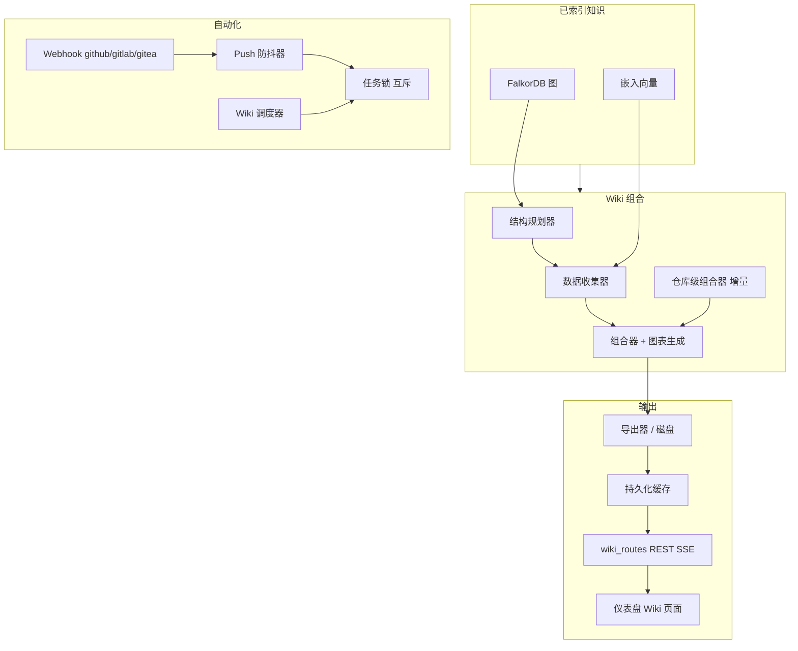
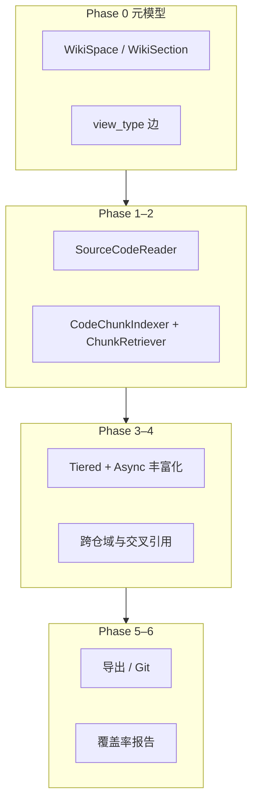
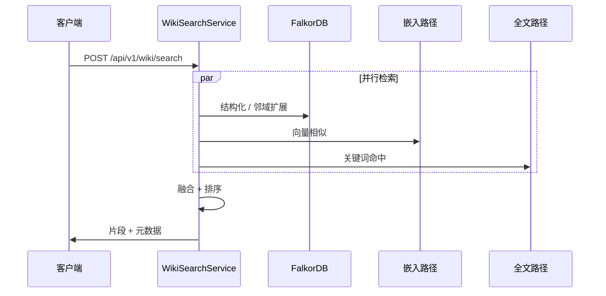

# Wiki 生成架构

本文档描述**生成式 Wiki 页面**如何融入 Knowledge Base Service：从**索引代码图**和**嵌入**中获取输入，经过**组合管道**；在**全量升级草案**（[llm-wiki-full-upgrade-design](superpowers/specs/2026-04-26-llm-wiki-full-upgrade-design.md)）的 **SP3–SP6** 叙述范围内，**HTTP 增量子系统**、**双 MCP 面**、**质量与记忆（LLM Wiki v2）** 等能力已可启用；*SP 编号*与 [v2 已批准 spec](superpowers/specs/2026-04-26-llm-wiki-v2-upgrade-design.md) 中的 **SP1–SP7** **不是**同一套标签（见 [IMPLEMENTATION-STATUS.md](IMPLEMENTATION-STATUS.md)）。并说明自动化（Webhook、**Lint 调度**、**AutoHealer 库**）与 **混合 Wiki 搜索** 的关系。

## 目标

- 将**索引属性图**（Tree-sitter → FalkorDB + 向量）转化为 **Markdown**（**Mermaid**、**`[[Wikilink]]` → 可点击 Markdown 链接**）和**稳定源码位置交叉链接**。
- 支持**全量/增量**再生成、**Ingest+changelog** 可观测、多种 **LLM 后端**（OpenAI 兼容）与**仪表盘**浏览。
- 暴露主 **MCP**（`mcp_server.py` + `wiki/mcp_tools.py` 共 20 个工具）与 **可选的 Wiki 专用 HTTP MCP 六工具**（`/api/v1/mcp/tools/*`，`TOOL_DEFINITIONS`）；与完整 HTTP `/api/v1/wiki/*` 面并行（详见 [MCP-INTEGRATION.md](MCP-INTEGRATION.md)）。
- **LLM Wiki v2**：页级**置信度**、**跨页矛盾**、**主张/替代**、**记忆分层 + 遗忘**、**YAML 模式校验**（见下文专节）。

## 分层管道

Wiki 行为的功能开关位于 `config.py` 的 **`WIKI__*`**（`WikiConfig`）。LLM 路由使用 `LLMProviderFactory` 和 OpenAI 兼容的 **LLM__** 配置。

## Phase 0–6 能力扩展（后端）

在既有「结构规划 → 数据收集 → 组合」流水线之上，实现分阶段增强：**元模型与树 API**、**代码感知与重要性**、**Chunk 级 RAG**、**百科式分层异步丰富化**、**跨仓业务 Wiki 与交叉引用**、**多格式导出与 Git 推送**、**覆盖率与探索问题**。架构总览见 [ARCHITECTURE.md](ARCHITECTURE.md) § Wiki 生成管道。旧版曾引用独立 spec 文件 `2026-04-24-wiki-enhancement-design.md`、`2026-04-26-wiki-tree-architecture-design.md`；二者**未**以独立文件随仓库提供，请改用 [IMPLEMENTATION-STATUS.md](IMPLEMENTATION-STATUS.md) 中的「与代码一致的高层次快照」与 [2026-04-26-llm-wiki-v2-upgrade-design.md](superpowers/specs/2026-04-26-llm-wiki-v2-upgrade-design.md) 等现存设计文。

| 阶段 | 要点 |
|------|------|
| **Phase 0** | `WikiSpace` / `WikiSection`、`HAS_CHILD` + `view_type`（`business_domain` / `code_structure`）；`WikiPage` 扩展 `path`、`version`、`importance_tier`、`content_hash`、`repositories`；**`GET /wiki/tree`** |
| **Phase 1** | `SourceCodeReader`；`ImportanceScorer`（core/standard/skeleton）；按 tier 的 token 预算 |
| **Phase 2** | `CodeChunkIndexer`、`ChunkRetriever`；**`POST /wiki/chunks/index`** |
| **Phase 3** | `TieredPromptBuilder`、`AsyncEnrichmentPipeline`（base→enriched→encyclopedia）、`BusinessDomainPlanner`、`EnrichmentLevel` |
| **Phase 4** | `CrossRepoBusinessDomainPlanner`、`WikiReferenceGenerator`、`DomainOverviewComposer`、`WikiService.generate_business_wiki()`；**`POST /api/v1/wiki/business/generate`**（**202** + `task_id`）、**`GET /api/v1/wiki/business/tasks/{task_id}`**、**`GET /api/v1/wiki/pages/{uid}/references`**；MCP：`wiki_get_tree`、`wiki_get_related`、`wiki_get_domain_overview` |
| **Phase 5** | `WikiLinkConverter`、`BusinessWikiExporter`、`ObsidianExporter`、`MkDocsExporter`、`GitPublisher`；**`POST /wiki/export`**（markdown/zip/git/obsidian/mkdocs 等） |
| **Phase 6** | `WikiCoverageAnalyzer`、`SuggestedQuestionsGenerator`；**`GET /wiki/coverage-report`** |

### 延迟 Enrichment 流程

当 `LLM__ENRICHMENT_STRATEGY=disabled`（默认）时，索引阶段不调用 LLM。Wiki 生成前由 `DeferredEnrichmentService`（`wiki/deferred_enrichment.py`）批量补全缺少 `business_summary` 的实体，随后推理 BusinessFlow 节点，最后刷新受影响实体的 embedding。流程：

1. `DeferredEnrichmentService.enrich_remaining()` — 批量 LLM enrichment
2. `WikiService._generate_business_flows()` — 从入口函数调用链推理 BusinessFlow
3. 页面组合（Tier 1/2/3）
4. `DeferredEnrichmentService.refresh_stale_embeddings()` — 增量 embedding 刷新

## Wiki 混合搜索

Wiki 搜索结合**图上下文**、**向量相似性**和**全文**信号，然后在 `wiki/search.py` 中应用 **RRF 风格融合**（与主产品的融合模式一致）。**Ask** 模式复用检索并可通过 **SSE** 流式输出。

### HTTP 搜索入口

旧版 **`POST /search`** 和 **`POST /business/search`** 已移除，统一使用 **`POST /api/v1/hybrid`** 并通过 `entity_type` 查询业务实体。在 **MCP** 侧，使用 **`rag_query`** 配合 `entity_type` 设为 `flow` 或 `concept` 替代已移除的业务专用工具。

可选 LLM 索引功能（**概念提取**、**业务流推断**）在 `LLMConfig` 中默认**关闭**；需要时显式启用。

## 业务 Wiki 异步生成与增量（跨仓）

- **`POST /api/v1/wiki/business/generate`**（Editor+）：触发跨仓库**业务** Wiki 生成。响应为 **202 Accepted**，正文包含 **`task_id`** 与 `status: "pending"`，实际工作在后台执行；同一 **business** 已有一次生成在跑时返回 **409 Conflict**（`generation_in_progress`）。请求体字段 **`incremental`**（默认 **true**）为 **true** 时，按仓库**新鲜度**跳过索引未变且 Wiki 已生成的仓库（`store/wiki_page_store.get_repo_wiki_freshness`）；为 **false** 时全量重算各仓。
- **`GET /api/v1/wiki/business/tasks/{task_id}`**：查询后台任务（进度、当前仓库、跳过数等）。任务元数据在 Redis 可用时由 **`WikiTaskStore`**（`wiki/task_store.py`）持久化并带 TTL。
- **仪表盘**：`useWikiRegenerate` 在提交后轮询 `businessWikiTaskStatus`；`WikiShell` 提供**增量/全量**开关与**进度**展示（i18n 键 `wiki.regenerate*`）。设计定稿见 [2026-04-27-wiki-generation-architecture-improvement-design](superpowers/specs/2026-04-27-wiki-generation-architecture-improvement-design.md)。

## 增量 Ingest、Changelog 与自动 Ingest

- **`POST /api/v1/wiki/ingest`**：按变更文件集合触发**增量**再生成/修补（与 `ChangeDetector`、任务锁配合，避免全库重写）。
- **`GET /api/v1/wiki/changelog?repository=...`**：读 `WikiChangeLogStore` 中的近期变更记录，便于排障与审计。
- **`POST /api/v1/hooks/ingest/push`**：接收类 GitHub `push` 的载荷，在 Webhook 已启用时**自动**触发与 Ingest 等价的处理链。

开关与图可用性以运行时 `bootstrap_wiki` 与存储为准；若未配置，路由返回 503/空表（与测试一致）。

## 深度研究、反馈与 Q&A 记忆

- **深度研究**：`POST /api/v1/wiki/research`（`WIKI__DEEP_RESEARCH_ENABLED`）在 `wiki/deep_research.py` 中做多轮子问题分解与综合，依赖 `LLM__ENABLED` 与 Ask 服务。
- **用户反馈**：`POST /api/v1/wiki/pages/{page_uid}/feedback`、**`GET .../feedback/summary`** 写入/汇总图上的反馈，供**置信度**子分数使用（`wiki/confidence_inputs.py`）。
- **Memory Loop**：`wiki/memory_loop.py` 对问答做嵌入检索与注入；生成管线在组稿时**拼接相关记忆**到上下文中。若启用 **`WIKI__MEMORY_TIERS_ENABLED`**，由 `wiki/memory_tiers.py` 维护 **Working → Episodic → Semantic → Procedural** 晋升规则；**`WIKI__FORGETTING_ENABLED`** 时依访问与稳定性**降低**低优先记忆的排序权重（Ebbinghaus 风格，**不物理删除**节点）。初值与 **`WIKI__FORGETTING_INITIAL_STABILITY`** 对齐 `WikiConfig`。
- **概念合并**：`WIKI__CONCEPT_MERGING_ENABLED` 时，跨仓库实体经嵌入相似度与阈值 **`WIKI__CONCEPT_MERGE_SIMILARITY_THRESHOLD`** 产出候选，HTTP **`GET /api/v1/wiki/merge-candidates`**（详见路由实现）。
- **内联 `[[Wikilink]]` 与 AGENTS.md**：组合器/链接器将 `[[EntityName]]` 解析为指向已有 `WikiPage` 的 Markdown 链接；`wiki/agents_md_generator.py` 从元数据生成 **AGENTS 风格**说明文档，供仓库内 Agent 与导出物阅读。

**业务流图**：`GET /api/v1/wiki/flows?business_id=...` 返回 `BusinessFlow` 节点列表；仪表盘以 **@xyflow/react** 作图，与 Phase 4 的流推理数据一致。

## LLM Wiki v2：质量、矛盾与主张

- **置信度（0.0–1.0）**：`WIKI__CONFIDENCE_SCORING_ENABLED` 时，在生成后及 lint 中由 `wiki/confidence_scorer.py` 依来源覆盖、**新鲜度**、**用户反馈**、**交叉引用**、**矛盾罚分**等加权（权重 **`WIKI__CONFIDENCE_WEIGHT_W1`–`W5`**）计算，回写 `WikiPage.confidence_score`。
- **矛盾检测**：`WIKI__CONTRADICTION_DETECTION_ENABLED` 时跨页发现陈述冲突，经 LLM **judge** 后持久化；**`GET /api/v1/wiki/contradictions?...`** 列出与页关联的记录，**`PATCH /api/v1/wiki/contradictions/{uid}/acknowledge|resolve`**（Editor）做工作流状态迁移。
- **主张 / 替代 / 版本**：`WIKI__SUPERSESSION_TRACKING_ENABLED` 时维护主张链与**替代**关系；**`GET /api/v1/wiki/pages/claim-history`** 拉取与页相关的主张与版本记录（`store/wiki_claim_store` 等）。
- **模式校验**：`WIKI__SCHEMA_VALIDATION_ENABLED` 时，`WikiLintService` 用 **`WIKI__SCHEMA_PATH`** 指向的 YAML 校验生成页**区块结构**，与 **`WIKI__STALE_DETECTION_ENABLED`**（`WikiConfig.stale_detection_enabled`，嵌套 `WIKI__`）等 lint 门组合使用。

## 自动化（Webhook、Wiki 调度、Lint 调度、AutoHealer）

- **通用 Webhook**：`api/routes/webhook_routes.py`，**`/api/v1/hooks/{provider}`** 等，签名与防抖；另见 **`/api/v1/hooks/ingest/push`**（上文）。
- **Wiki 调度器**：`wiki/scheduler/` 协调定期**再生成/导出**计划，与 **`TaskLock`** 互斥，避免与 Ingest/Webhook 并发写同一树。
- **LintScheduler**（`wiki/lint_scheduler.py`）：`WIKI__LINT_SCHEDULER_ENABLED=true` 时按 **`WIKI__LINT_SCHEDULER_INTERVAL_HOURS`** 周期调用 `WikiLintService`（可含**置信度重算**、**模式校验**、**矛盾**相关后处理，视功能开关而定）。
- **AutoHealer**（`wiki/auto_healer.py`）：`AutoHealer` 类提供 **`remove_broken_references`**（清理悬空 `WIKI_REFERENCES` 边）与 **`deprecate_orphan_pages`**（无 `SOURCE_ENTITY` 的页标记为弃用）。模块**刻意不包含**「陈旧页自动打标」（见 `auto_healer.py` 顶注）。**Phase 0 已完成接入**：`WIKI__AUTO_HEAL_ENABLED=true`（默认）时，`WikiLintService.run_lint()` 在 lint 后自动调用 `AutoHealer.heal()`，并将 heal 指标（`refs_removed` / `pages_deprecated`）写入 `WikiChangeLog`；HTTP API、MCP、`LintScheduler` 均走 `run_lint` 统一路径。

## 相关模块

| 关注点 | 位置 |
|--------|------|
| 模型 / 作用域 | `wiki/models.py`、`wiki/context.py` |
| 延迟 Enrichment | `wiki/deferred_enrichment.py` |
| 规划 / 组合 / 内链 | `wiki/structure_planner.py`、`wiki/data_collector.py`、`wiki/composer.py`、`wiki/diagram_gen.py`、链接转换相关模块 |
| 仓库级 / 增量 | `wiki/repo_composer.py`、`wiki/incremental.py`、`wiki/disk_exporter.py`、`wiki/persistent_cache.py`；业务 Wiki 仓库级新鲜度与跳过见 **`store/wiki_page_store`**（`get_repo_wiki_freshness`）、**`wiki/service.generate_business_wiki`** |
| 任务与锁 | `wiki/task_store.py`（`WikiTaskStore`）、`wiki/task_registry.py`；HTTP **`api/routes/wiki_task_routes.py`**（`/business/generate`、**`/business/tasks/{task_id}`**） |
| 搜索 / 问答 / 深度研究 | `wiki/search.py`、`wiki/ask.py`、`wiki/deep_research.py` |
| 质量 v2 | `wiki/confidence_scorer.py`、`wiki/confidence_inputs.py`、`store/wiki_contradiction_store.py`、`store/wiki_claim_store.py` |
| 记忆与遗忘 | `wiki/memory_loop.py`、`wiki/memory_tiers.py`、`store/wiki_qa_store.py`、`store/wiki_memory_store.py` |
| Lint / 自愈 / 调度 | `wiki/lint.py`、`wiki/lint_scheduler.py`、`wiki/auto_healer.py` |
| 变更与 Ingest | `wiki/change_detector.py`、`store/wiki_changelog.py` |
| Agent 文档 | `wiki/agents_md_generator.py` |
| MCP | `wiki/mcp_tools.py` + `api/mcp_server.py`；可选 **`api/mcp_wiki_server.py`** |
| HTTP 路由 | `api/routes/wiki_routes.py`（聚合）、`api/routes/wiki_*_routes.py`、`api/routes/provider_routes.py` |
| 仪表盘 | `dashboard/src/pages/`（含 Wiki、**业务流/xyflow** 视图） |

## MCP 与 HTTP 的权威来源

- 主服务 **20 个** MCP 工具（含 8 个 `WIKI_MCP_*`）见 [MCP-INTEGRATION.md](MCP-INTEGRATION.md) § A；**`GET /api/v1/mcp/tools`** 为唯一合并清单。
- 可选 **6 个** Wiki 工具（`wiki_search`、`wiki_explain`、`wiki_navigate`、`wiki_qa`、`wiki_impact`、`wiki_get_snapshot`）见同文档 § B；**`WIKI__MCP_SERVER_ENABLED`**，端点 **`/api/v1/mcp/tools/list`** / **`/api/v1/mcp/tools/call`**。

跨功能分析另见主 MCP 的 **`analyze_changes`**（`wiki_pr_impact` 等）。
