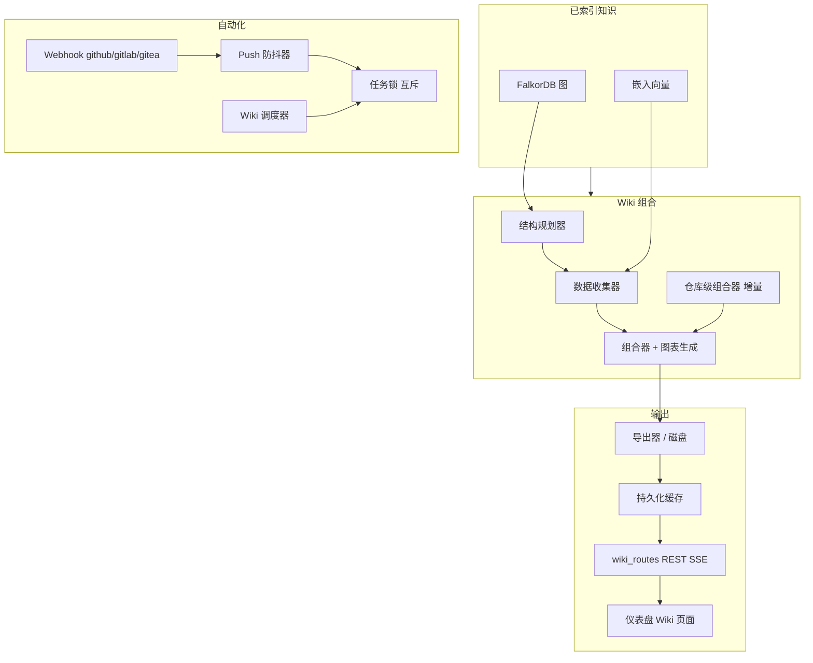
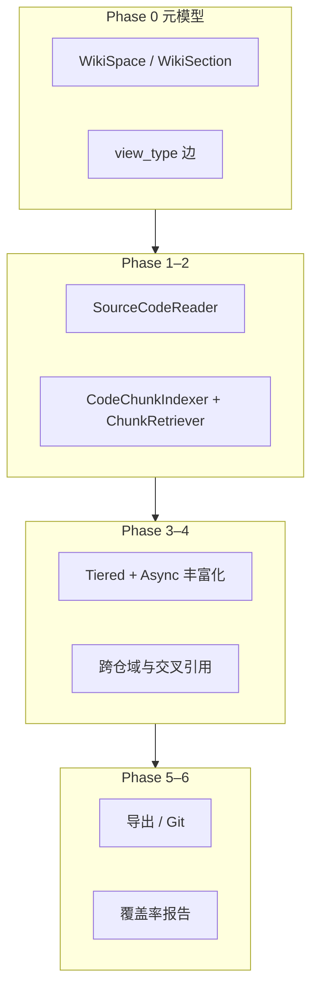
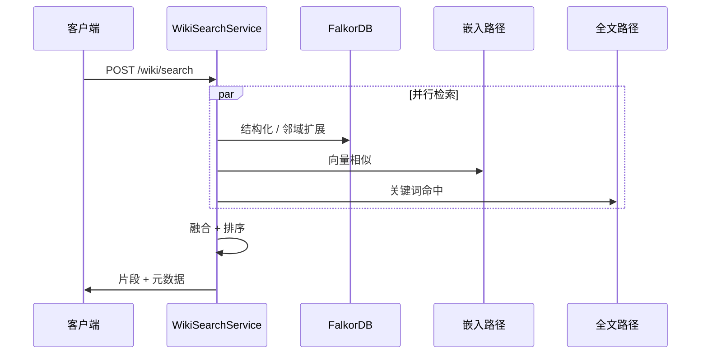

# Wiki 生成架构

本文档描述**生成式 Wiki 页面**如何融入 Knowledge Base Service：从**索引代码图**和**嵌入**中获取输入，经过**组合管道**，自动化（Webhook、调度器），以及**混合 Wiki 搜索**与产品其他部分的关系。

## 目标

- 将**索引属性图**（Tree-sitter → FalkorDB + 向量）转化为 **Markdown**（适当时包含 **Mermaid** 图表）和**稳定的源码位置交叉链接**。
- 支持**增量再生成**、多种 **LLM 后端**（OpenAI 兼容），以及**仪表盘**浏览。
- 暴露 **MCP 工具**（`get_wiki_page`、`list_wiki_pages`、`search_wiki`、`wiki_export`）与 HTTP Wiki 路由并行提供。

## 分层管道

Wiki 行为的功能开关位于 `config.py` 的 **`WIKI__*`**（`WikiConfig`）。LLM 路由使用 `LLMProviderFactory` 和 OpenAI 兼容的 **LLM__** 配置。

## Phase 0–6 能力扩展（后端）

在既有「结构规划 → 数据收集 → 组合」流水线之上，实现分阶段增强：**元模型与树 API**、**代码感知与重要性**、**Chunk 级 RAG**、**百科式分层异步丰富化**、**跨仓业务 Wiki 与交叉引用**、**多格式导出与 Git 推送**、**覆盖率与探索问题**。架构总览见 [ARCHITECTURE.md](ARCHITECTURE.md) § Wiki 生成管道；细节以设计规格为准：[2026-04-24-wiki-enhancement-design.md](superpowers/specs/2026-04-24-wiki-enhancement-design.md)、[2026-04-26-wiki-tree-architecture-design.md](superpowers/specs/2026-04-26-wiki-tree-architecture-design.md)。

| 阶段 | 要点 |
|------|------|
| **Phase 0** | `WikiSpace` / `WikiSection`、`HAS_CHILD` + `view_type`（`business_domain` / `code_structure`）；`WikiPage` 扩展 `path`、`version`、`importance_tier`、`content_hash`、`repositories`；**`GET /wiki/tree`** |
| **Phase 1** | `SourceCodeReader`；`ImportanceScorer`（core/standard/skeleton）；按 tier 的 token 预算 |
| **Phase 2** | `CodeChunkIndexer`、`ChunkRetriever`；**`POST /wiki/chunks/index`** |
| **Phase 3** | `TieredPromptBuilder`、`AsyncEnrichmentPipeline`（base→enriched→encyclopedia）、`BusinessDomainPlanner`、`EnrichmentLevel` |
| **Phase 4** | `CrossRepoBusinessDomainPlanner`、`WikiReferenceGenerator`、`DomainOverviewComposer`、`WikiService.generate_business_wiki()`；**`POST /wiki/business/generate`**、**`GET /pages/{uid}/references`**；MCP：`wiki_get_tree`、`wiki_get_related`、`wiki_get_domain_overview` |
| **Phase 5** | `WikiLinkConverter`、`BusinessWikiExporter`、`ObsidianExporter`、`MkDocsExporter`、`GitPublisher`；**`POST /wiki/export`**（markdown/zip/git/obsidian/mkdocs 等） |
| **Phase 6** | `WikiCoverageAnalyzer`、`SuggestedQuestionsGenerator`；**`GET /wiki/coverage-report`** |

### 延迟 Enrichment 流程

当 `LLM__ENRICHMENT_STRATEGY=disabled`（默认）时，索引阶段不调用 LLM。Wiki 生成前由 `DeferredEnrichmentService`（`wiki/deferred_enrichment.py`）批量补全缺少 `business_summary` 的实体，随后推理 BusinessFlow 节点，最后刷新受影响实体的 embedding。流程：

1. `DeferredEnrichmentService.enrich_remaining()` — 批量 LLM enrichment
2. `WikiService._generate_business_flows()` — 从入口函数调用链推理 BusinessFlow
3. 页面组合（Tier 1/2/3）
4. `DeferredEnrichmentService.refresh_stale_embeddings()` — 增量 embedding 刷新

## Wiki 混合搜索

Wiki 搜索结合**图上下文**、**向量相似性**和**全文**信号，然后在 `wiki/search.py` 中应用 **RRF 风格融合**（与主产品的融合模式一致）。**Ask** 模式复用检索并可通过 **SSE** 流式输出。

### HTTP 搜索入口

旧版 **`POST /search`** 和 **`POST /business/search`** 已移除，统一使用 **`POST /api/v1/hybrid`** 并通过 `entity_type` 查询业务实体。在 **MCP** 侧，使用 **`rag_query`** 配合 `entity_type` 设为 `flow` 或 `concept` 替代已移除的业务专用工具。

可选 LLM 索引功能（**概念提取**、**业务流推断**）在 `LLMConfig` 中默认**关闭**；需要时显式启用。

## 自动化（Webhook 和定时计划）

- **Webhook**：`api/routes/webhook_routes.py`，路径 `/api/v1/hooks/{provider}`，包含签名验证和推送防抖处理。
- **调度器**：`wiki/scheduler/` 协调定期再生成，与 **`TaskLock`** 协作确保 Webhook 触发和定时任务不会并发损坏同一导出。

## 相关模块

| 关注点 | 位置 |
|--------|------|
| 模型 / 作用域 | `wiki/models.py`、`wiki/context.py` |
| 延迟 Enrichment | `wiki/deferred_enrichment.py` |
| 规划 / 组合 | `wiki/structure_planner.py`、`wiki/data_collector.py`、`wiki/composer.py`、`wiki/diagram_gen.py` |
| 仓库级 / 增量 | `wiki/repo_composer.py`、`wiki/incremental.py`、`wiki/disk_exporter.py`、`wiki/persistent_cache.py` |
| 搜索 / 问答 | `wiki/search.py`、`wiki/ask.py` |
| MCP Wiki 接口 | `wiki/mcp_tools.py`（清单在 `api/mcp_server.py` 中合并） |
| HTTP 路由 | `api/routes/wiki_routes.py`、`api/routes/provider_routes.py` |
| 仪表盘 | `dashboard/src/pages/`（Wiki 相关视图） |

## MCP 工具（Wiki）

核心 Wiki 工具注册在 **`WIKI_MCP_TOOLS_MANIFEST`** 中：**`get_wiki_page`**、**`list_wiki_pages`**、**`search_wiki`**、**`wiki_export`**。Phase 4 起增加树与域相关能力：**`wiki_get_tree`**、**`wiki_get_related`**、**`wiki_get_domain_overview`**（与上述工具一并以便 Agent 拉取业务视图、关联页与域总览）。HTTP 组合目录通过 **`GET /api/v1/mcp/tools`** 获取 — 以此为工具名称和 Schema 的权威来源。**`wiki_export`** 至少需要 **Editor** 角色。

跨功能分析工具中结合 Wiki 与变更影响分析的，参见 **`analyze_changes`** 的 `impact_scope` 和 `wiki_pr_impact` 模式，详见 [MCP-INTEGRATION.md](MCP-INTEGRATION.md)。
