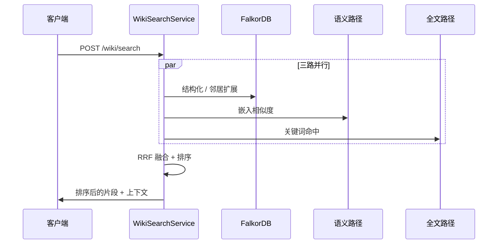

# Wiki 生成架构

已实现的 Wiki 技术栈参考文档（**P1 + P1.5 + P2 + P3**）。权威需求清单和分阶段规划见 [`superpowers/specs/2026-04-17-wiki-generation-design.md`](superpowers/specs/2026-04-17-wiki-generation-design.md)。

## 目标

- 将**已索引的代码图谱**（Tree-sitter → FalkorDB + 向量嵌入）转化为**Markdown + Mermaid 文档**，并包含**精确的源码定位**。
- 支持**全仓库**叙述（P2）、**增量刷新**、**多 LLM 后端**以及 **Dashboard 浏览**。

## 分层流水线

```mermaid
flowchart TB
    subgraph ingest [已索引的知识]
        G[FalkorDB 图谱]
        V[向量嵌入]
    end

    subgraph compose [组合层]
        P[WikiStructurePlanner]
        D[WikiDataCollector]
        C[WikiComposer]
        MG[diagram_gen.py]
    end

    subgraph p2 [P2 扩展]
        RC[repo_composer.py]
        INC[incremental.py]
        PT[page_templates.py]
    end

    subgraph p3 [P3 自动化与编排]
        WH[Webhook 接收层<br/>hooks/github|gitlab|gitea]
        PD[PushDebouncer + EventDispatcher]
        WS[WikiScheduler<br/>interval + asyncio]
        TL[TaskLock<br/>再生互斥]
    end

    subgraph out [输出与体验]
        EX[WikiExporter / disk_exporter]
        PC[persistent_cache + LRU]
        API[wiki_routes REST / SSE]
        UI[Dashboard WikiPage]
    end

    G --> P --> D --> C --> MG --> EX
    RC --> PT
    C --> RC
    INC --> C
    V --> D
    EX --> PC
    EX --> API
    API --> UI
    WH --> PD --> TL
    WS --> TL
    TL -.->|与增量/Cron 协调| EX
```

## 检索栈（P1.5）

**混合搜索**结合图查询、语义相似度和全文搜索，使用 **RRF 融合**进行排序。**Ask** 功能复用此栈，通过 **SSE** 流式输出。



### Track C（P3）：全局搜索入口统一

知识库 HTTP 层面 **`POST /search`** 与 **`POST /business/search`** 已标记**废弃**，通用检索请使用 **`POST /hybrid`**，并通过 **`entity_type`** 过滤业务实体（`flow` / `concept`）或代码实体。MCP 侧 **`rag_business_search`** 废弃，合并到 **`rag_query`**（`entity_type`）。索引管线中 **`ConceptExtractor`**、**`BusinessFlowInferencer`** 默认关闭，需显式打开对应 LLM 配置项才会在索引时生成扩展图节点。

## LLM 集成（P2）

`LLMProviderFactory` 支持选择 **gateway**、**openai**、**azure** 或 **custom** OpenAI 兼容后端。Wiki 组合通过 `LLMPortBridge` 保持传输层无关性。**`GET /api/v1/llm/providers`** 列出已配置的提供商。

## P3 扩展

### Webhook 与定时再生（Track A）

- **入站路由**：`api/routes/webhook_routes.py`，前缀 **`/api/v1/hooks`**。`POST /hooks/{provider}` 仅接受 `github` / `gitlab` / `gitea`；`WebhookReceiver` 校验签名与事件类型，**`PushDebouncer`** 在时间窗内合并多次 push，**`EventDispatcher`** 调用挂接到 `app.state` 的增量更新端口（与索引进程对接）。**`GET/PUT /hooks/config`** 管理启用开关、debounce 秒数、自动更新分支与各 provider 密钥。
- **定时 Wiki 再生**：实现位于 **`wiki/scheduler/wiki_scheduler.py`**（**`WikiScheduler`**：`ScheduleConfig` 支持 interval 模式，后台 **`asyncio`** 循环调度）与 **`wiki/scheduler/task_lock.py`**（**`TaskLock`**：与 Webhook 或手工触发的再生任务互斥，防止同仓并发写）。

### Ask v2 与图遍历工具（Track B）

- **Ask v2**：`wiki/ask.py` 中 **`detect_question_type`** 基于关键词将问题归为 concept / flow / relation / impact / general；**`GraphEnhancedContextCollector`** 从检索命中抽取种子符号，按问题类型执行 **多跳 Cypher**（调用链、最短路径、反向影响等），并与 Wiki 页正文、签名、模块摘要等段落一起经 **`_assemble_sections`** 做 **token 预算**裁剪，再交给 LLM 生成回答。
- **图遍历 MCP**：**`traverse_call_chain`**、**`find_impact_scope`**、**`analyze_pr_impact`** 定义于 **`wiki/mcp_tools.py`**，委托 **`GraphQueryService`**（`query/graph_query.py`），无 LLM、返回结构化 JSON。
- **HTTP PR 影响 API**：**`POST /api/v1/wiki/{repository}/analyze-impact`** 与 MCP **`analyze_pr_impact`** 同源，便于外部 PR Bot 仅消费数据。

## 相关模块

| 领域 | 模块 |
|------|------|
| 核心 | `wiki/models.py`, `structure_planner.py`, `data_collector.py`, `composer.py`, `context.py`, `diagram_gen.py`, `exporter.py`, `service.py` |
| 搜索 / 问答 | `wiki/search.py`, `wiki/ask.py` |
| P2 | `wiki/repo_composer.py`, `wiki/page_templates.py`, `wiki/incremental.py`, `wiki/disk_exporter.py`, `wiki/persistent_cache.py` |
| LLM | `llm/base_provider.py`, `llm/provider_factory.py`, `llm/openai_provider.py`, `llm/azure_provider.py`, `llm/custom_provider.py` |
| API / UI | `api/routes/wiki_routes.py`, `api/routes/webhook_routes.py`, `api/routes/provider_routes.py`, `dashboard/src/pages/WikiPage.tsx` |
| P3 Webhook / 调度 | `wiki/webhook/*`, `wiki/scheduler/*` |

## MCP 工具

Wiki 相关共 **八个** MCP 工具：`generate_wiki`、`get_wiki_page`、`list_wiki_pages`、`search_wiki`、`ask_about_code`、`traverse_call_chain`、`find_impact_scope`、`analyze_pr_impact`，注册到现有 MCP HTTP 服务端面 — 调用模式详见 [`MCP-INTEGRATION.md`](MCP-INTEGRATION.md)。完整工具列表以运行时 **`GET /api/v1/mcp/tools`** 为准。
