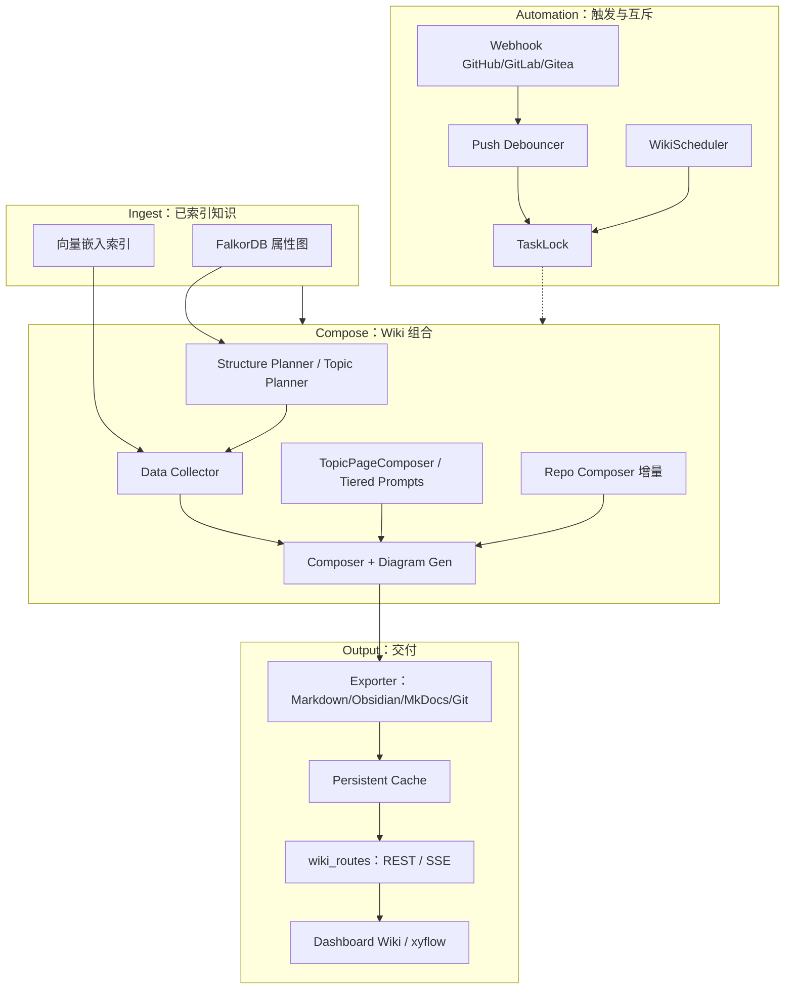
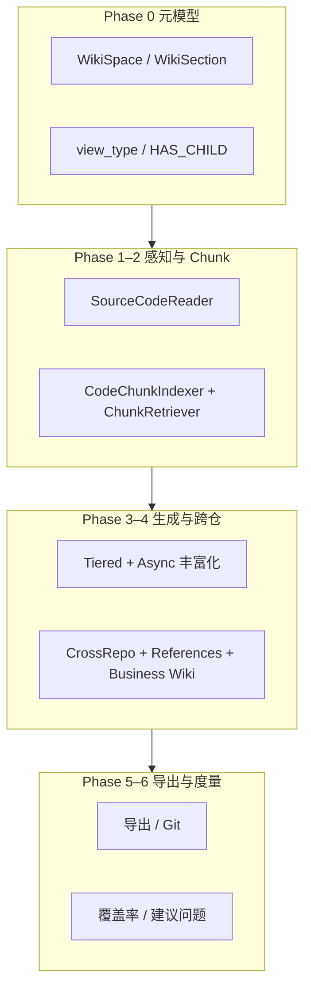
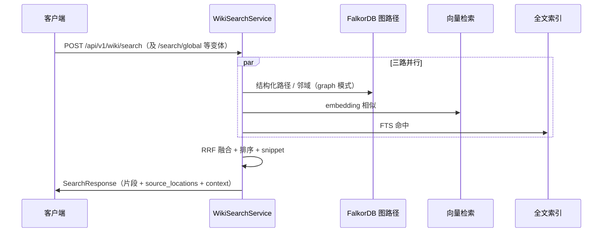

# Wiki 生成管道架构（设计参考）

本文档是 **Knowledge Base Service** 中**生成式 Wiki** 流水线的**权威设计参考**：说明如何将**已索引的属性图**（Tree-sitter 解析 → **FalkorDB** 图 + **向量嵌入**）转化为面向人类与 Agent 的 **Markdown Wiki**；如何与 **HTTP REST/SSE**、**主 MCP（22 工具）**、**可选 Wiki HTTP MCP（6 工具）**、**仪表盘**及 **LLM Wiki v2**（质量、矛盾、主张、记忆）协同。

**与实现对照**：功能开关集中在 `WikiConfig` / `LLMConfig` 等（环境变量前缀多为 `WIKI__*`、`LLM__*`）。主架构见 [ARCHITECTURE.md](ARCHITECTURE.md)；MCP 契约见 [MCP-INTEGRATION.md](MCP-INTEGRATION.md)；剩余工作见 [REMAINING-WORK.md](REMAINING-WORK.md)。

---

## 1. 目标与概述

### 1.1 核心目标

| 维度 | 说明 |
|------|------|
| **输入** | 索引后的**属性图**（模块/类/函数/调用关系等）与 **Embedding**，来源于 Tree-sitter 流水线写入 FalkorDB 及向量索引。 |
| **输出** | 结构化 **Markdown** Wiki：可含 **Mermaid**、`source://`  style 源码锚点、`[[Wikilink]]` → **可点击 Markdown 链接**，并持久化为 `WikiPage` 节点及关联边。 |
| **再生模式** | **全量**与**增量**：单仓补丁（变更检测）、跨仓业务 Wiki（按仓库新鲜度跳过）、导出与缓存失效策略相互配合。 |
| **暴露面** | **22 个主 MCP 工具**（`api/mcp_server.py` 合并核心清单与 `wiki/mcp_tools.py` 的 Wiki 清单）+ **6 个可选 Wiki HTTP MCP 工具**（`api/mcp_wiki_server.py`，需 `WIKI__MCP_SERVER_ENABLED`）；与 **`/api/v1/wiki/*`** REST/SSE 并行。 |
| **LLM Wiki v2** | 页级**置信度**、**跨页矛盾检测**、**主张/替代链**、**记忆分层与遗忘**、**YAML 区块结构校验**等与 Lint / 调度器联动（见第 9、10 节）。 |

### 1.2 非目标（边界）

- **全量代码索引**不通过 MCP 对外暴露（仅 HTTP/Dashboard 等路径触发）；Wiki 生成假设图与向量已可用。
- **陈旧页自动打标**不属于 `AutoHealer` 的设计范围（见第 10 节）；陈旧检测走独立 `WIKI__STALE_DETECTION_*` 与 Lint。

### 1.3 关键术语

- **Ingest layer**：已存在于图与向量存储中的「只读上游」。
- **Compose layer**：结构规划 → 数据拉取 → LLM/模板组稿 → 图表 → 可选仓级增量合成。
- **Automation**：Webhook 防抖、Wiki 定时调度、`TaskLock` 互斥。
- **Output**：导出器、磁盘/Redis 缓存、`wiki_*` 路由、仪表盘。

---

## 2. 分层管道（Mermaid）

下列流程概括 **数据如何从图/向量进入 Wiki，再到达 API/UI**。箭头表示典型依赖方向（非严格的单次线性顺序——异步任务与增量路径会分叉）。



**说明**

- **Structure Planner**：仓内层级与页面骨架（含 Phase 0 视图：`business_domain` / `code_structure`）。
- **Data Collector**：从图拉取实体邻域、摘要、chunk、交叉引用素材。
- **Composer**：`wiki/composer.py` 等与 LLM 端口、`TieredPromptBuilder`、`TopicPageComposer` 协作生成正文与图表（`wiki/diagram_gen.py`）。
- **Repo Composer**：`wiki/repo_composer.py`、`wiki/incremental.py` — 增量更新已有树，降低全量重写成本。
- **REST/SSE**：`api/routes/wiki_routes.py` 聚合 `wiki_page_routes`、`wiki_task_routes`、`wiki_ask_routes`、`wiki_feedback_routes`、`wiki_contradiction_routes` 等；Ask/深度检索路径可 **SSE** 流式事件。

---

## 3. Phase 0–6 能力（详表）

下列阶段在「结构规划 → 数据收集 → 组合」主干上**累加能力**；后端类名与路由以仓库源码为准。

### Phase 0：Wiki 元模型与树 API

| 能力项 | 实现要点 |
|--------|----------|
| **空间与分区** | `WikiSpace`、`WikiSection`；父子关系 **`HAS_CHILD`**。 |
| **视图类型** | 边上 **`view_type`**：`business_domain`（业务域视图）与 `code_structure`（代码结构视图）；仪表盘「双视图」依赖 `WikiConfig.dual_view_enabled` 等。 |
| **WikiPage 扩展属性** | `path`、`version`、`importance_tier`、`content_hash`、`repositories`（跨仓聚合）、置信度与其它 v2 字段（若启用）。 |
| **HTTP** | **`GET /api/v1/wiki/tree`** — 浏览 Wiki 树（Dashboard 调用客户端时常省略前缀，直连网关后为完整路径）。 |
| **相关模块** | `wiki/models.py`、`store/wiki_store.py`、`api/routes/wiki_page_routes.py` |

### Phase 1：代码感知与重要性分层

| 能力项 | 实现要点 |
|--------|----------|
| **SourceCodeReader** | `wiki/source_code_reader.py` — 按实体拉取可读源码片段供组稿上下文。 |
| **ImportanceScorer** | `wiki/importance_scorer.py` — 将实体归类为 **`core` / `standard` / `skeleton`**（重要性 Tier）。 |
| **Token 预算** | `wiki/tiered_prompts.py` 等与 **`ImportanceTier`** 绑定：Core 更高预算，Skeleton 压低篇幅，避免上下文爆炸。 |
| **LangGraph 协同** | `wiki/pipeline_graph.py` 中 `quality_gate_node` 按 Tier 区分阈值与 heal 重试次数。 |

### Phase 2：Chunk 级索引与检索

| 能力项 | 实现要点 |
|--------|----------|
| **CodeChunkIndexer** | `wiki/code_chunk_indexer.py` — 将代码块写入可检索索引（与向量/chunk 存储协同）。 |
| **ChunkRetriever** | `wiki/chunk_retriever.py` — RAG 式检索片段供组稿或问答。 |
| **HTTP** | **`POST /api/v1/wiki/chunks/index`**（`api/routes/wiki_feedback_routes.py`，通常需 **EDITOR** 角色）。 |

### Phase 3：分层 Prompt 与异步丰富化

| 能力项 | 实现要点 |
|--------|----------|
| **TieredPromptBuilder** | `wiki/tiered_prompts.py` — 按 Tier 拼装系统/用户指令与预算。 |
| **AsyncEnrichmentPipeline** | `wiki/async_enrichment.py` — 层次 **`base → enriched → encyclopedia`**（百科式加深）；与异步任务、超时策略配合。 |
| **BusinessDomainPlanner** | `wiki/business_domain_planner.py` — 模块 → 业务域的 LLM 分类；大单仓 **`WIKI__BUSINESS_DOMAIN_SUB_BATCH_SIZE`** 子批调用后合并，降低单次 payload 与读超时风险。 |
| **SSE** | 分类路径上 LLM 调用可走 **`LLMPortBridge.generate_stream()`**（`llm/base_provider.py`），便于长时间生成的增量响应。 |
| **EnrichmentLevel** | `wiki/models.py` 等定义的枚举/常量 — 标识 enrich 深度阶段。 |

### Phase 4：跨仓业务 Wiki、交叉引用与异步任务

| 能力项 | 实现要点 |
|--------|----------|
| **CrossRepoBusinessDomainPlanner** | `wiki/cross_repo_domain_planner.py` — 多仓 **`asyncio.gather`**；**`WIKI__BUSINESS_DOMAIN_MAX_CONCURRENCY`**；单仓 **`WIKI__BUSINESS_DOMAIN_CLASSIFY_TIMEOUT`**；**进程内有界缓存**，键含内容哈希，**TTL `WIKI__BUSINESS_DOMAIN_CACHE_TTL`**（容量如 32，详见部署文档）。 |
| **WikiReferenceGenerator** | `wiki/reference_generator.py` — 「相关页面」段落、`[[wikilink]]` 注入等。 |
| **DomainOverviewComposer** | `wiki/domain_overview_composer.py` — 域级总览合成。 |
| **WikiService.generate_business_wiki()** | `wiki/service.py` — 编排跨仓生成、与 **LangGraph** 管线（`wiki/pipeline_orchestrator.run_langgraph_pipeline`）对接，持久化页面与引用边。 |
| **HTTP** | **`POST /api/v1/wiki/business/generate`** → **202** + **`task_id`**；**`GET /api/v1/wiki/business/tasks/{task_id}`**；**`GET /api/v1/wiki/pages/{uid}/references`**。 |
| **MCP** | `wiki_get_tree`、`wiki_get_related`、`wiki_get_domain_overview`（清单见 [MCP-INTEGRATION.md](MCP-INTEGRATION.md)）。 |

### Phase 5：导出与 Git 发布

| 能力项 | 实现要点 |
|--------|----------|
| **WikiLinkConverter** | `wiki/wikilink_converter.py` — `[[path]]` ↔ 标准 Markdown / Obsidian 格式双向转换。 |
| **BusinessWikiExporter** | `wiki/business_wiki_exporter.py` — 跨仓业务导出打包。 |
| **ObsidianExporter** | `wiki/obsidian_exporter.py` — Vault 布局与 `.obsidian` 配置，保留 wikilink 语义。 |
| **MkDocsExporter** | `wiki/mkdocs_exporter.py` — `mkdocs.yml` + 文档树。 |
| **GitPublisher** | `wiki/git_publisher.py` — 推送远端（受 `WikiConfig.git_publish_*` 等约束）。 |
| **HTTP** | **`POST /api/v1/wiki/export`** — 支持 **markdown / zip / git / obsidian / mkdocs** 等格式（见路由参数与 handler）。 |

### Phase 6：覆盖率与探索式问答建议

| 能力项 | 实现要点 |
|--------|----------|
| **WikiCoverageAnalyzer** | `wiki/coverage_analyzer.py` — 度量 Wiki 对代码/域的覆盖情况。 |
| **SuggestedQuestionsGenerator** | `wiki/suggested_questions.py` — 生成「下一步可读什么」类问题，驱动仪表盘探索。 |
| **HTTP** | **`GET /api/v1/wiki/coverage-report`** |

### Phase 依赖关系（示意）



---

## 4. 延迟 Enrichment 流程

当 **`LLM__ENRICHMENT_STRATEGY=disabled`**（默认）时，索引阶段**不会**批量写 `business_summary`。Wiki 生成前由 **`DeferredEnrichmentService`**（`wiki/deferred_enrichment.py`）在 **Wiki 阶段**补全图中仍缺摘要的实体，再驱动业务流推理与向量刷新。

| 步骤 | 入口 | 行为 |
|------|------|------|
| 1 | `DeferredEnrichmentService.enrich_remaining(repository)` | 查询缺少 `business_summary` 的 Function/Class，过滤琐碎实体后 **`CodeSummaryEnricher.enrich_batch`**，写回图属性。 |
| 2 | `WikiService._generate_business_flows()` | 基于入口与调用链推理 **`BusinessFlow`** 节点（与 Phase 4 流图、`GET /api/v1/wiki/flows` 一致）。 |
| 3 | **页面组合** | 按 **Tier 1 / 2 / 3**（骨架 → 标准 → 核心）决定组稿深度与图表密度（见 `WikiService` / `composer` / LangGraph 节点）。 |
| 4 | `DeferredEnrichmentService.refresh_stale_embeddings(repository)` | 对「刚获得 summary」的实体 **重新嵌入**，保持向量检索与混合搜索新鲜度（依赖构造时注入 `EmbeddingGenerator`）。 |

**注意**：延迟 enrichment 与 **Phase 3 AsyncEnrichmentPipeline** 互补：前者偏「索引后缺口回填」，后者偏「/wiki 正文分层加厚」。

---

## 5. Wiki 混合搜索（Mermaid 序列图）

**WikiSearchService**（`wiki/search.py`）并行三路：**图路径检索**、**向量相似**、**全文（FTS）**，再经 **`search/fusion.py` 的 RRF**（Reciprocal Rank Fusion）融合；权重常量：**图 ×2.0**、**向量 ×1.0**、**全文 ×1.5**。查询可先 **`expand_query_with_graph`**：抽取 PascalCase/dotted/CJK 词并扩展邻居实体名。



**Ask 模式**：`wiki/ask.py` 的 **`WikiAskService`** 复用检索内核；可与 **`IterativeRAGEngine`**（第 13 节）组合，通过 **SSE** 推送 `draft` / `searching` / `evaluating` 等事件（见 `wiki/rag/events.py`）。

---

## 6. 业务 Wiki 异步生成

| 项目 | 说明 |
|------|------|
| **触发** | **`POST /api/v1/wiki/business/generate`**（常见角色：**EDITOR**）；响应 **202 Accepted**，body 含 **`task_id`**、`status: pending`。 |
| **互斥** | 同一 **business_id** 若已有生成进行中 → **409 Conflict**（`generation_in_progress`）。 |
| **增量** | 请求体 **`incremental`**（默认 **true**）：按仓库跳过「索引指纹未变且 Wiki 已生成」的仓（`store/wiki_page_store.get_repo_wiki_freshness`）；**false** 时对各仓强制重算。 |
| **进度查询** | **`GET /api/v1/wiki/business/tasks/{task_id}`** — `current_repository`、`skipped_repos`、`partial_errors` 等。 |
| **持久化** | **`WikiTaskStore`**（`wiki/task_store.py`）：Redis Hash **`kb:wiki_tasks:{task_id}`**，默认 **TTL 1800s**；业务级生成锁 **`kb:wiki_gen_lock:{business_id}`**（Lua CAS 解锁）。 |
| **仪表盘** | `dashboard/src/hooks/useWikiRegenerate.ts` — 提交后轮询 **`businessWikiTaskStatus`**；`WikiShell.tsx` 提供增量/全量开关与进度文案（i18n `wiki.regenerate*`）。 |

---

## 7. 增量 Ingest、Changelog、自动 Ingest

| HTTP | 角色 / 说明 |
|------|-------------|
| **`POST /api/v1/wiki/ingest`** | 按变更文件集合触发增量 wiki 修补；与 **`wiki/change_detector.py`**、`TaskLock`、生成信号量协作，避免与调度器/Webhook 打架。 |
| **`GET /api/v1/wiki/changelog?repository=...`** | 读取 **`WikiChangeLogStore`** 近期记录，审计「谁、何时、因何」触达 wiki。 |
| **`POST /api/v1/hooks/ingest/push`** | 类 GitHub **`push`** JSON；经 **`WebhookReceiver`**、**`PushDebouncer`** 去抖后进入与 ingest 等价的增量链（`api/routes/webhook_routes.py`）。 |

**Provider 路由**：**`/api/v1/hooks/{github|gitlab|gitea}`** 等与 **通用 Webhook** 配置、签名校验在同一模块族（`wiki/webhook/*`）。

---

## 8. 深度研究、反馈、Q&A 记忆

### 8.1 深度研究

- **HTTP**：**`POST /api/v1/wiki/research`**（`api/routes/wiki_ask_routes.py`）。
- **开关**：**`WIKI__DEEP_RESEARCH_ENABLED`**；服务 **`wiki/deep_research.py`**（`DeepResearchService`）分解子问题 → 子问题可走 **`IterativeRAGEngine`** → 再综合。
- **依赖**：**`LLM__ENABLED`**、Ask/RAG 装配完整。

### 8.2 用户反馈

- **HTTP**：**`POST /api/v1/wiki/pages/{page_uid}/feedback`**；**`GET .../feedback/summary`**。
- **用途**：写入图上反馈节点；作为 **`wiki/confidence_inputs.py`** 的子信号进入置信度。

### 8.3 Memory Loop 与分层

- **核心**：**`wiki/memory_loop.py`** — 对问答历史做 **嵌入检索** 并注入组稿/作答上下文。
- **分层**：**`WIKI__MEMORY_TIERS_ENABLED`** 时 **`wiki/memory_tiers.py`** 维护 **Working → Episodic → Semantic → Procedural** 晋升。
- **遗忘**：**`WIKI__FORGETTING_ENABLED`** 时 **`wiki/forgetting.py`** — Ebbinghaus 风格 **权重衰减**（排序降权，**非物理删除**）；初稳 **`WIKI__FORGETTING_INITIAL_STABILITY`** 等与 `WikiConfig` 对齐。

### 8.4 概念合并与 Wikilink

- **合并**：**`WIKI__CONCEPT_MERGING_ENABLED`** + **`wiki/concept_merger.py`**；跨仓实体嵌入相似度超过 **`WIKI__CONCEPT_MERGE_SIMILARITY_THRESHOLD`** 产生候选；**`GET /api/v1/wiki/merge-candidates`**。
- **Wikilink**：**`wiki/wikilink_resolver.py`**、`WikiLinkConverter`、`WikiLinkCache` — 解析 **`[[EntityName]]`** 为 Markdown 链接；LangGraph **`create_links_node`** / **`WikiService._persist_resolved_pipeline_wikilinks`** 可将 **`resolved_links`** 落成 **`WIKI_REFERENCES`**（`relation_type=wikilink`）。

### 8.5 AGENTS.md 与业务流图

- **AGENTS.md**：**`wiki/agents_md_generator.py`** — 从元数据生成仓库内 Agent 可读说明。
- **业务流 UI**：**`GET /api/v1/wiki/flows?business_id=...`** → `BusinessFlow` 列表；仪表盘 **`@xyflow/react`** 渲染（与 `_generate_business_flows` 数据一致）。

---

## 9. LLM Wiki v2：质量、矛盾、主张

### 9.1 置信度（0.0–1.0）

- **开关**：**`WIKI__CONFIDENCE_SCORING_ENABLED`**。
- **实现**：**`wiki/confidence_scorer.py`** + **`wiki/confidence_inputs.py`**。
- **子维度**：**来源覆盖**、**新鲜度**、**用户反馈**、**交叉引用（含入链 wikilink）**、**矛盾罚分**等；权重 **`WIKI__CONFIDENCE_WEIGHT_W1`–`W5`**。
- **落库**：回写 **`WikiPage.confidence_score`**；**`LintScheduler`** 可周期性重算（见下节）。

### 9.2 矛盾检测

- **开关**：**`WIKI__CONTRADICTION_DETECTION_ENABLED`**。
- **实现**：**`wiki/contradiction_detector.py`** + **`store/wiki_contradiction_store.py`** — 跨页陈述经 LLM **judge**。
- **HTTP**：**`GET /api/v1/wiki/contradictions?...`**；**`PATCH /api/v1/wiki/contradictions/{uid}/acknowledge|resolve`**（工作流状态）。

### 9.3 主张 / 替代 / 版本链

- **开关**：**`WIKI__SUPERSESSION_TRACKING_ENABLED`**。
- **存储**：**`store/wiki_claim_store.py`** 等。
- **HTTP**：**`GET /api/v1/wiki/pages/claim-history`** — 页相关主张与时间线。

### 9.4 模式校验

- **开关**：**`WIKI__SCHEMA_VALIDATION_ENABLED`**。
- **行为**：**`WikiLintService`** 使用 **`WIKI__SCHEMA_PATH`** 指向的 **YAML** 校验生成页的**章节结构**。
- **协同**：可与 **`WIKI__STALE_DETECTION_ENABLED`**（嵌套于 `WikiConfig`）等 Lint 规则一并作为质量门。

---

## 10. 自动化

| 组件 | 路径 | 职责 |
|------|------|------|
| **Webhook** | `api/routes/webhook_routes.py` | **`/api/v1/hooks/*`**：签名、provider 校验、与 **`wiki/webhook/receiver.py`**、**`PushDebouncer`**、**`EventDispatcher`** 协作。 |
| **WikiScheduler** | `wiki/scheduler/wiki_scheduler.py` | 基于 **`ScheduleConfig`** 的间隔再生；调用前 acquire **`TaskLock`**（`wiki/scheduler/task_lock.py`），避免与 ingest 并发写同一树。 |
| **LintScheduler** | `wiki/lint_scheduler.py` | **`WIKI__LINT_SCHEDULER_ENABLED`** 时按 **`WIKI__LINT_SCHEDULER_INTERVAL_HOURS`** 调用 **`WikiLintService.run_lint()`** — 可触发模式校验、置信度刷新、矛盾相关后处理（取决于各 `WIKI__*`）。 |
| **AutoHealer** | `wiki/auto_healer.py` | **`remove_broken_references`**（清理悬空 **`WIKI_REFERENCES`**）；**`deprecate_orphan_pages`**（无 **`SOURCE_ENTITY`** 的页标记弃用）。**刻意不包含**「陈旧页自动打标」（模块顶部注释）。 |
| **接入点** | `WIKI__AUTO_HEAL_ENABLED`（默认 true） | **`WikiLintService.run_lint()`** 末尾调用 **`AutoHealer.heal()`**，指标写入 **`WikiChangeLog`**；HTTP / MCP / LintScheduler 共用该路径。 |

---

## 11. LangGraph 管道（Issue 1 类增强）

### 11.1 EntityRoleClassifier（两阶段）

**`wiki/entity_role_classifier.py`**

| 阶段 | 行为 |
|------|------|
| **Phase 1** | 确定性规则：命名模式（如 `*Controller`）、注解（`RestController`、`Service`…）、框架噪声剔除。 |
| **Phase 2** | **业务逻辑密度评分**：方法数（扣减 getter）、图度、语义 role、LOC 等加权；阈值划分 **`ENTRY_POINT` / `HAS_BUSINESS_LOGIC` / `SUPPORTING` / `DATA_MODEL` / `FRAMEWORK_NOISE`**。 |

**`DOMAIN_CLASSIFICATION_ENTITY_ROLES`**：仅 **`HAS_BUSINESS_LOGIC`** 与 **`ENTRY_POINT`** 参与业务域分类输入裁剪。

### 11.2 Wiki 生成 StateGraph（节点级真相）

**`wiki/pipeline_graph.build_wiki_pipeline()`** 编译 **`StateGraph(WikiPipelineState)`**，主线为：

`classify_entity_roles` → `detect_reorg` →（条件）`graph_decompose` → `assign_canonical_keys` → `generate_titles` → `set_review_status` → `compose_leaf_modules` → `compose_bottomup` → **`quality_gate`** ⇄ **`heal_pages`** → `create_links` → `finalize`。

- **detect_reorg**：若 **`reorg_type == none`** 可直接 **`finalize`**（无变更短路）。
- **graph_decompose**：`GraphModuleDecomposer` 通过 FalkorDB 图查询生成确定性模块树，大 SCC 支持 LLM 语义聚类回退。
- **assign_canonical_keys / generate_titles**：为模块树节点分配稳定 canonical key 和人类可读标题。
- **compose_leaf_modules**：`WikiGenerationHarness` 驱动叶模块页面生成（含 `WikiPageAgent` 工具调用、sectional 生成策略）。
- **compose_bottomup**：自下而上合成父模块页面（`ParentSynthesizer`），叶节点可使用图查询上下文增强。
- **quality_gate**：L1 结构检查 + `verify_citations` 引用校验（罚分）/ L2 静态 benchmark（代码引用、Mermaid、交叉引用）/ 可选 L3 LLM judge（4×1-5 via `WikiPageEvaluator`，仅 Core Tier）；不合格页进入 **heal** 循环，总尝试 **`HEAL_LOOP_MAX_TOTAL_ATTEMPTS`**（默认 10）兜底。

### 11.3 与「四阶段」概念的映射（便于对照 RFC）

| 概念阶段 | 图节点 |
|----------|--------|
| **Classify & Decompose** | `classify_entity_roles`、`detect_reorg`、`graph_decompose`、`assign_canonical_keys`、`generate_titles`、`set_review_status` |
| **Leaf content** | `compose_leaf_modules` + `compose_bottomup` + **`quality_gate`** / **`heal_pages`** |
| **Link & Finalize** | `create_links`、`finalize` |

### 11.4 TopicPageComposer

**`wiki/topic_page_composer.py`**：**`DomainComplexityScorer`** 判定 **LOW / MEDIUM / HIGH** → 策略分流（单页简洁 vs 概览+子页 vs LLM 分组与高预算）；输出含 **Mermaid 业务流**、**DATA_MODEL 表格**等；与 **`compose_leaf_pages_node`** 协作。

### 11.5 编排入口

**`wiki/pipeline_orchestrator.run_langgraph_pipeline`** — 将 **`WikiService`** 的 **`GraphNode`** 转为 LangGraph state，执行后将 **`domain_mapping`、`domain_tree`、`pages`、`resolved_links`、`entity_roles`** 交回 **`WikiService.generate_business_wiki`**。

---

## 12. Agent 框架（`wiki/agents/`）

Wiki 管线中 **compose_leaf_modules** 节点驱动 **WikiPageAgent** 生成页面内容，底层依赖统一 Agent 框架。

### 12.1 核心组件

| 组件 | 模块 | 职责 |
|------|------|------|
| **GenericAgent** | `wiki/agents/base_agent.py` | 基类：LLM + ToolRegistry + Memory；子类覆写 `system_prompt` / `tools` |
| **run_agent_loop()** | `wiki/agents/runner.py` | 统一执行引擎；接受 `LoopConfig`（max_turns, timeout, detect_repeated_calls）、`LoopHooks`（回调）；返回 `AgentLoopResult` |
| **@function_tool** | `wiki/agents/tool_decorator.py` | 从函数签名自动生成 `ToolDef` JSON Schema |
| **agent_tool()** | `wiki/agents/agent_tool.py` | Agent-as-Tool 工厂；将子 Agent 包装为 `ToolDef` |
| **RunContext** | `wiki/agents/context.py` | 类型化依赖注入容器 per-run |
| **Guardrails** | `wiki/agents/guardrails.py` | Input / Output 护栏 |
| **AgentTracer** | `wiki/agents/tracing.py` | Span 跟踪 + JsonlTraceProcessor |
| **Handoff** | `wiki/agents/handoff.py` | 子 Agent 委托（深度 / 数量限制） |

### 12.2 执行流（Mermaid）

```mermaid
sequenceDiagram
  participant Caller as 调用方（Pipeline Node）
  participant Loop as run_agent_loop
  participant LLM as LLM Provider
  participant Tool as Tool Function

  Caller->>Loop: agent, input, LoopConfig
  loop turn ≤ max_turns
    Loop->>LLM: complete_with_tools(messages, tools)
    alt LLM 返回 text
      Loop-->>Caller: AgentLoopResult(output)
    else LLM 返回 tool_calls
      Loop->>Loop: repeated call detection
      Loop->>Tool: execute(args)
      Tool-->>Loop: result → append messages
    end
  end
```

### 12.3 Tool Tier 渐进激活

| Tier | 激活条件 | 典型工具 |
|------|----------|----------|
| T1 | 始终可用 | get_entity_info, query_graph, search_code |
| T2 | ≥ round 3 | get_call_chain, find_implementations |
| T3 | ≥ round 5 | read_source_file, analyze_dependencies |

由 `GenericAgent._get_active_tools(round_num)` 控制；避免 LLM 在早期被过多工具干扰。

### 12.4 重复调用检测

`LoopConfig.detect_repeated_calls`（默认 `True`）：若 LLM 连续请求相同 `(tool_name, arguments)` 组合，自动中断循环并返回当前积累结果，防止 token 浪费。

### 12.5 WikiPageAgent 工具集（14 Tools）

通过 `@function_tool` 注册在 `wiki/page_agent.py`：`get_entity_info`, `get_module_entities`, `search_code`, `query_graph`, `get_call_chain`, `find_implementations`, `get_dependencies`, `read_source_file`, `check_wiki_links`, `get_related_pages`, `analyze_dependencies`, `get_entity_context`, `search_similar_code`, `get_file_structure`。

---

## 13. 模型策略（Model Strategy）

### 12.1 动态路由

**`wiki/model_strategy.py` — `ModelStrategy`**

- **`resolve(task_type, ...)`**：优先读 **`SettingsStore`** 键 **`llm.strategy.{task_type}`**（JSON：`provider` + `model`）；否则可按 **`complexity_metrics.recommended_strategy`** 回落；最终默认 **`LLMProviderFactory`** 的默认 provider/model。
- **`get_llm_port(task_type)`**：返回 **`_LLMPortWithDefault`** 包装的 **`LLMPortBridge`**，在 **`complete` / `generate`** 时注入路由得到的 **model**。

**常用 task_type 示例**（非穷尽）：**`rag_generate`**、**`rag_plan`**、**`rag_evaluate`** — 由 **`IterativeRAGEngine`** 在节点内按需索取。

### 12.2 全局 LLM 配置

**`config.py` — `LLMConfig`**

| 字段 | 典型环境变量前缀 | 用途 |
|------|------------------|------|
| **`model`** | `LLM__MODEL` | 默认合成/通用调用模型。 |
| **`deep_search_model`** | `LLM__DEEP_SEARCH_MODEL`（命名随 Settings 映射） | **`query/deep_search.DeepSearchEngine`** 等与深度检索相关的路由默认模型。 |

**`LLMProviderFactory`**（`llm/provider_factory.py`）负责按 provider 名实例化 OpenAI 兼容客户端；网关模式见 **`LLMConfig.gateway`**（ACP）。

---

## 14. 迭代式 RAG

### 13.1 IterativeRAGEngine

**`wiki/rag/engine.py`**

- **图结构**：LangGraph **`StateGraph(RAGState)`** — 节点包括 **`initial_search`** → **`generate_draft`** → 条件分支 → **`finalize` | `evaluate` | `plan` | `dynamic_retrieve`**。
- **draft**：LLM 输出 JSON：`answer`、`gaps`、`next_queries`、`confidence`、`is_complete`；高置信可短路完成。
- **evaluate**：独立 **`score`**；低于阈值则 **`plan`** 生成 **2–4** 条子查询 → **`dynamic_retrieve`** 追加 chunk → 下一轮。
- **model_strategy**：各节点可选用 **`rag_generate` / `rag_plan` / `rag_evaluate`** 不同端口。
- **SSE**：**`wiki/rag/events.rag_sse_append`** 累积事件列表；流式入口 **`arun_stream`** 供 HTTP 深度搜索等消费。

### 13.2 max_rounds

- **`RAGState.max_rounds`**：控制最大迭代轮数（构造 `IterativeRAGEngine` / `arun` 参数时传入）；具体默认以 **`kb_service`** 装配与调用方为准。

### 13.3 MCP：**`unified_knowledge_query`**

- **清单**：主 MCP **22** 工具之一（见 **`api/mcp_server.py`**）。
- **处理器**：**`wiki/mcp_tools.py`** — **`WikiMCPHandler.handle_unified_knowledge_query`**；若应用未挂载 **`rag_engine`** 返回 **`not_configured`**。
- **用途**：单次工具调用内完成「多轮检索 + 合成」，替代手动 **`list_wiki_pages` → get_page** 拼装。

---

## 15. 相关模块索引（扩展表）

| 关注点 | 路径 |
|--------|------|
| **领域模型 / WikiConfig** | `wiki/models.py`、`wiki/context.py`、`config.py`（`WikiConfig` / `AppWikiFlags`） |
| **延迟 Enrichment** | `wiki/deferred_enrichment.py`、`indexer/enrichment.py`、`indexer/embedding_generator.py` |
| **规划 / 收集 / 组稿** | `wiki/structure_planner.py`、`wiki/topic_structure_planner.py`、`wiki/data_collector.py`、`wiki/composer.py`、`wiki/diagram_gen.py`、`wiki/page_composer_service.py` |
| **业务域 / 跨仓** | `wiki/business_domain_planner.py`、`wiki/cross_repo_domain_planner.py`、`wiki/domain_overview_composer.py`、`wiki/dependency_graph.py` |
| **LangGraph** | `wiki/pipeline_graph.py`、`wiki/pipeline_nodes.py`、`wiki/pipeline_state.py`、`wiki/pipeline_orchestrator.py`、`wiki/quality_evaluator.py` |
| **实体角色** | `wiki/entity_role_classifier.py` |
| **主题页策略** | `wiki/topic_page_composer.py`、`wiki/domain_complexity.py` |
| **增量 / 仓级** | `wiki/repo_composer.py`、`wiki/incremental.py`、`wiki/disk_exporter.py`、`wiki/persistent_cache.py` |
| **新鲜度 / 持久化** | `store/wiki_page_store.py`（`get_repo_wiki_freshness`）、`wiki/persistence.py`、`wiki/service.py` |
| **任务 / 锁** | `wiki/task_store.py`、`wiki/task_registry.py`、`api/routes/wiki_task_routes.py` |
| **混合搜索 / 问答** | `wiki/search.py`、`wiki/ask.py`、`search/fusion.py` |
| **迭代 RAG** | `wiki/rag/engine.py`、`wiki/rag/protocol.py`、`wiki/rag/hybrid_graph_retriever.py`、`query/deep_search.py` |
| **深度研究** | `wiki/deep_research.py` |
| **模型路由** | `wiki/model_strategy.py`、`llm/provider_factory.py`、`llm/base_provider.py` |
| **置信度 / 矛盾 / 主张** | `wiki/confidence_scorer.py`、`wiki/confidence_inputs.py`、`wiki/contradiction_detector.py`、`store/wiki_contradiction_store.py`、`store/wiki_claim_store.py` |
| **记忆** | `wiki/memory_loop.py`、`wiki/memory_tiers.py`、`wiki/forgetting.py`、`store/wiki_memory_store.py`、`store/wiki_qa_store.py` |
| **Lint / 自愈 / 调度** | `wiki/lint.py`、`wiki/lint_scheduler.py`、`wiki/auto_healer.py`、`wiki/scheduler/wiki_scheduler.py`、`wiki/scheduler/task_lock.py` |
| **变更 / Ingest** | `wiki/change_detector.py`、`store/wiki_changelog.py` |
| **Chunk** | `wiki/code_chunk_indexer.py`、`wiki/chunk_retriever.py` |
| **重要性 / Tier** | `wiki/importance_scorer.py`、`wiki/tiered_prompts.py` |
| **Wikilink** | `wiki/wikilink_converter.py`、`wiki/wikilink_resolver.py`、`wiki/wikilink_cache.py`、`wiki/reference_generator.py`、`wiki/backlink_builder.py` |
| **导出** | `wiki/business_wiki_exporter.py`、`wiki/obsidian_exporter.py`、`wiki/mkdocs_exporter.py`、`wiki/git_publisher.py` |
| **覆盖率 / 建议** | `wiki/coverage_analyzer.py`、`wiki/suggested_questions.py` |
| **Agent 文档** | `wiki/agents_md_generator.py` |
| **Webhook** | `api/routes/webhook_routes.py`、`wiki/webhook/debounce.py`、`wiki/webhook/dispatcher.py`、`wiki/webhook/receiver.py`、`wiki/webhook/providers/*` |
| **MCP** | `wiki/mcp_tools.py`、`api/mcp_server.py`、`api/mcp_wiki_server.py`、`api/routes/wiki_mcp_routes.py` |
| **HTTP 聚合** | `api/routes/wiki_routes.py`、`wiki_page_routes`、`wiki_task_routes`、`wiki_ask_routes`、`wiki_feedback_routes`、`wiki_contradiction_routes`、`wiki_shared.py` |
| **仪表盘** | `dashboard/src/pages/*`、`dashboard/src/components/wiki/*`、`dashboard/src/hooks/useWikiRegenerate.ts`、`dashboard/src/hooks/useWikiSearch.ts` |
| **MCP-Wiki 适配** | `wiki/kb_wiki_pipeline.py`（`WikiPipelineAdapter`） |

---

## MCP 与 HTTP 的权威来源

- **主服务 22 个 MCP 工具**（核心 **12** + Wiki **10**）：[MCP-INTEGRATION.md](MCP-INTEGRATION.md) § A；**`GET /api/v1/mcp/tools`** 为合并清单唯一来源。
- **可选 6 个 Wiki HTTP MCP**：同文档 § B；**`WIKI__MCP_SERVER_ENABLED`**；**`/api/v1/mcp/tools/list`** / **`/api/v1/mcp/tools/call`**（字段名 **`name`**，与主 MCP 的 **`tool_name`** 不同）。
- **PR / 影响分析**：主 MCP **`analyze_changes`**（别名 **`wiki_pr_impact`**）等与变更图谱联动。

---

*文档版本与仓库源码同步维护；若路由前缀或开关默认值变更，请以对应 `api/routes/*.py` 与 `config.py` 为准。*
