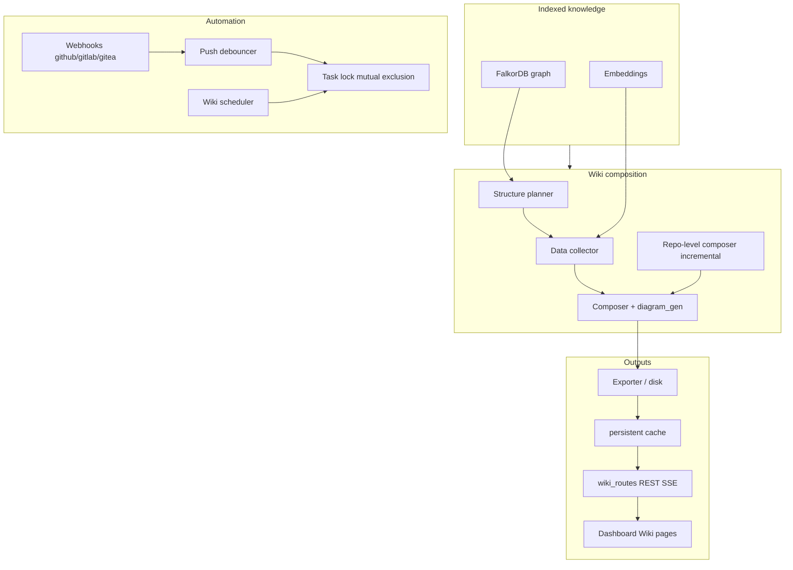
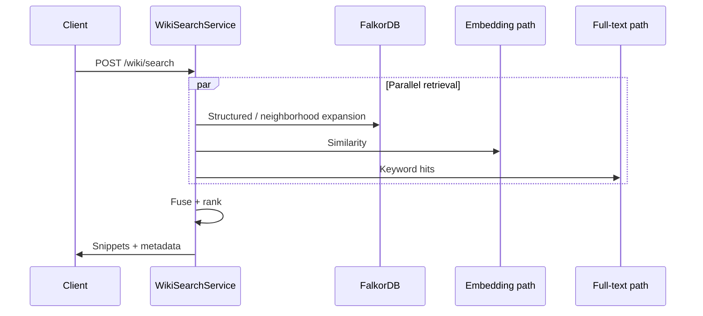

# Wiki generation architecture

This document describes how **generated wiki pages** fit into the Knowledge Base Service: inputs from the **indexed code graph** and **embeddings**, the **composition pipeline**, automation (webhooks, scheduler), and how **hybrid wiki search** relates to the rest of the product.

## Goals

- Turn the **indexed property graph** (Tree-sitter → FalkorDB + vectors) into **Markdown** (with **Mermaid** diagrams where applicable) and **stable cross-links** back to source locations.
- Support **incremental regeneration**, multiple **LLM backends** (OpenAI-compatible), and **dashboard** browsing.
- Expose **MCP tools** (`get_wiki_page`, `list_wiki_pages`, `search_wiki`, `wiki_export`) alongside the HTTP wiki routes.

## Layered pipeline

Feature flags for wiki behavior live under **`WIKI__*`** in `config.py` (`WikiConfig`). LLM routing uses `LLMProviderFactory` and OpenAI-compatible **LLM__** settings.

## Wiki hybrid search (P1.5)

Wiki search combines **graph context**, **vector similarity**, and **full-text** signals, then applies **RRF-style fusion** in `wiki/search.py` (aligned with the main product’s fusion patterns). **Ask** reuses retrieval and can stream via **SSE**.

### HTTP search entry points

Legacy **`POST /search`** and **`POST /business/search`** were removed in favor of **`POST /api/v1/hybrid`** with `entity_type` for business entities. On the **MCP** side, use **`rag_query`** with `entity_type` `flow` or `concept` instead of any removed business-only tool.

Optional LLM indexing features (**concept extraction**, **business flow** inference) default **off** in `LLMConfig`; enable explicitly when you want those graph extensions during indexing.

## Automation (webhooks and schedules)

- **Webhooks**: `api/routes/webhook_routes.py` under `/api/v1/hooks/{provider}` with signature validation and debounced push handling.
- **Scheduler**: `wiki/scheduler/` coordinates periodic regeneration and cooperates with **`TaskLock`** so webhook-triggered and scheduled jobs do not corrupt the same export concurrently.

## Related modules

| Concern | Location |
|---------|----------|
| Models / scopes | `wiki/models.py`, `wiki/context.py` |
| Planning / composition | `wiki/structure_planner.py`, `wiki/data_collector.py`, `wiki/composer.py`, `wiki/diagram_gen.py` |
| Repo-wide / incremental | `wiki/repo_composer.py`, `wiki/incremental.py`, `wiki/disk_exporter.py`, `wiki/persistent_cache.py` |
| Search / Ask | `wiki/search.py`, `wiki/ask.py` |
| MCP wiki surface | `wiki/mcp_tools.py` (manifest merged in `api/mcp_server.py`) |
| HTTP routes | `api/routes/wiki_routes.py`, `api/routes/provider_routes.py` |
| Dashboard | `dashboard/src/pages/` (Wiki-related views) |

## MCP tools (wiki)

Four wiki tools are registered in **`WIKI_MCP_TOOLS_MANIFEST`**: **`get_wiki_page`**, **`list_wiki_pages`**, **`search_wiki`**, **`wiki_export`**. The combined HTTP catalog is **`GET /api/v1/mcp/tools`** — use that as the source of truth for names and schemas. **`wiki_export`** requires at least **editor** role.

For cross-cutting analysis tools that combine wiki with change impact, see **`analyze_changes`** modes `impact_scope` and `wiki_pr_impact` in [MCP-INTEGRATION.md](MCP-INTEGRATION.md).
