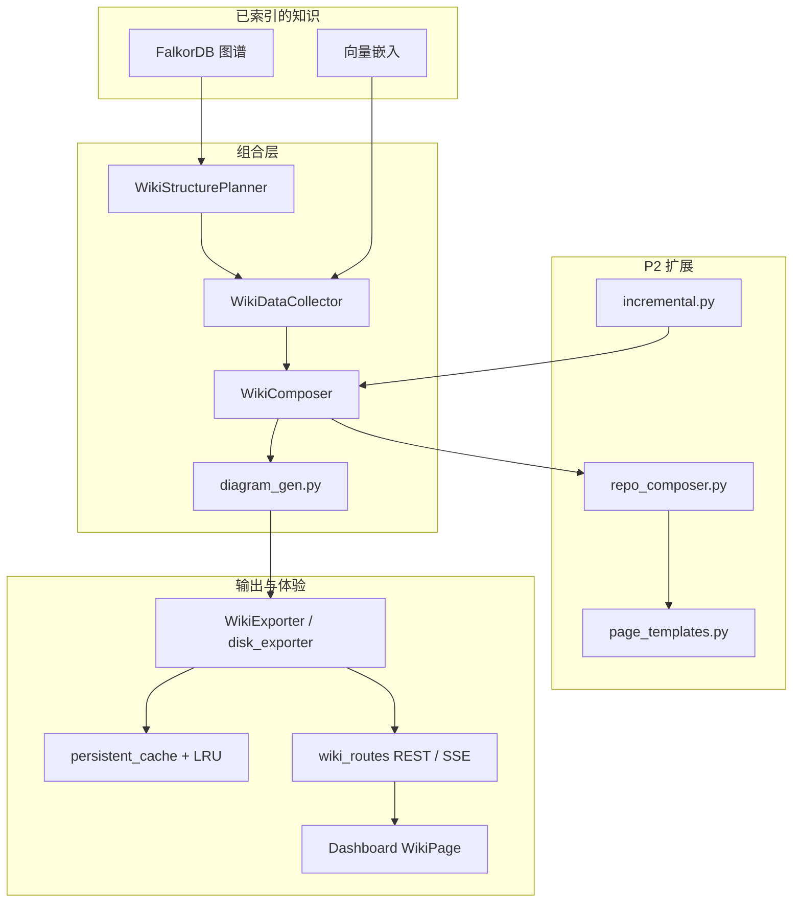
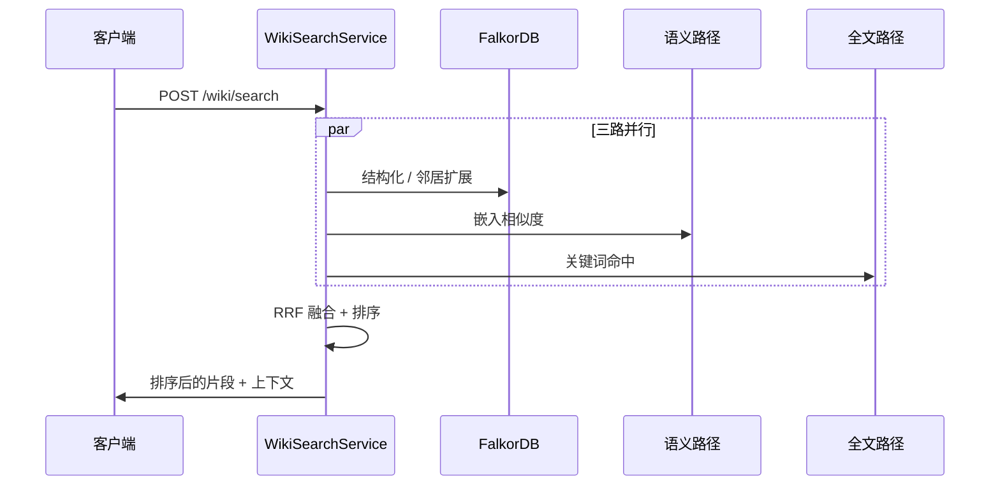

# Wiki 生成架构

已实现的 Wiki 技术栈参考文档（P1 + P1.5 + P2）。权威需求清单和分阶段规划见 [`superpowers/specs/2026-04-17-wiki-generation-design.md`](superpowers/specs/2026-04-17-wiki-generation-design.md)。

## 目标

- 将**已索引的代码图谱**（Tree-sitter → FalkorDB + 向量嵌入）转化为**Markdown + Mermaid 文档**，并包含**精确的源码定位**。
- 支持**全仓库**叙述（P2）、**增量刷新**、**多 LLM 后端**以及 **Dashboard 浏览**。

## 分层流水线

## 检索栈（P1.5）

**混合搜索**结合图查询、语义相似度和全文搜索，使用 **RRF 融合**进行排序。**Ask** 功能复用此栈，通过 **SSE** 流式输出。

## LLM 集成（P2）

`LLMProviderFactory` 支持选择 **gateway**、**openai**、**azure** 或 **custom** OpenAI 兼容后端。Wiki 组合通过 `LLMPortBridge` 保持传输层无关性。**`GET /api/v1/llm/providers`** 列出已配置的提供商。

## 相关模块

| 领域 | 模块 |
|------|------|
| 核心 | `wiki/models.py`, `structure_planner.py`, `data_collector.py`, `composer.py`, `context.py`, `diagram_gen.py`, `exporter.py`, `service.py` |
| 搜索 / 问答 | `wiki/search.py`, `wiki/ask.py` |
| P2 | `wiki/repo_composer.py`, `wiki/page_templates.py`, `wiki/incremental.py`, `wiki/disk_exporter.py`, `wiki/persistent_cache.py` |
| LLM | `llm/base_provider.py`, `llm/provider_factory.py`, `llm/openai_provider.py`, `llm/azure_provider.py`, `llm/custom_provider.py` |
| API / UI | `api/routes/wiki_routes.py`, `api/routes/provider_routes.py`, `dashboard/src/pages/WikiPage.tsx` |

## MCP 工具

五个工具（`generate_wiki`、`get_wiki_page`、`list_wiki_pages`、`search_wiki`、`ask_about_code`）注册到现有的 MCP HTTP 服务端面 — 调用模式详见 [`MCP-INTEGRATION.md`](MCP-INTEGRATION.md)。
