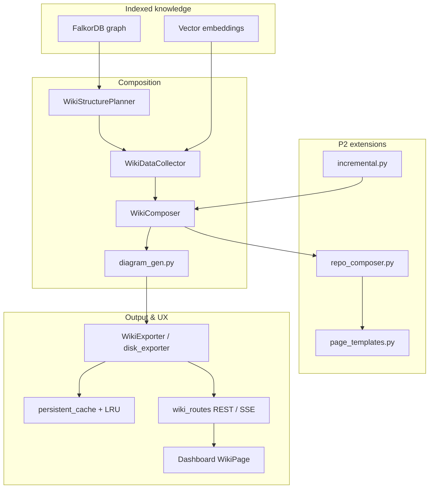
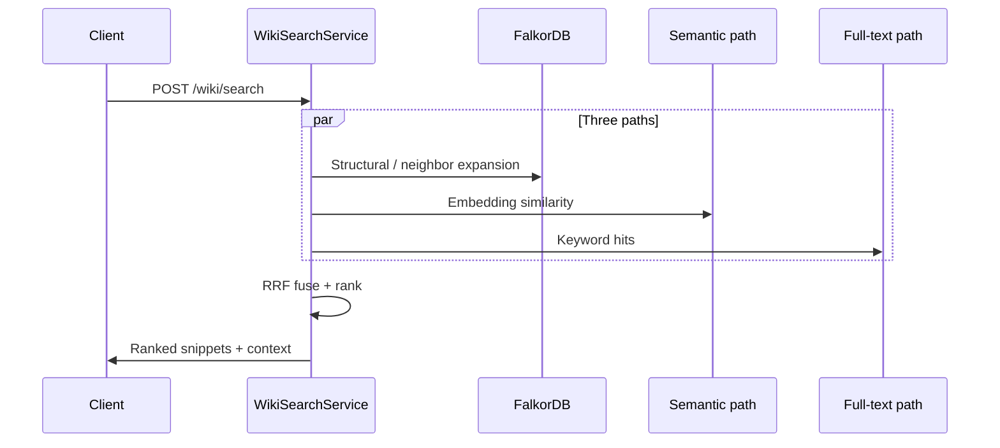

# Wiki Generation Architecture

Concise reference for the **implemented** Wiki stack (P1 + P1.5 + P2). Authoritative checklist and phased requirements live in [`superpowers/specs/2026-04-17-wiki-generation-design.md`](superpowers/specs/2026-04-17-wiki-generation-design.md).

## Goals

- Turn the **indexed code graph** (Tree-sitter → FalkorDB + embeddings) into **Markdown + Mermaid** documentation with **exact source locations**.
- Support **full repository** narratives (P2), **incremental** refresh, **multi-LLM** backends, and **Dashboard** browsing.

## Layered pipeline

## Retrieval stack (P1.5)

**Hybrid search** combines graph queries, semantic similarity, and full-text search with **RRF fusion**. **Ask** reuses this stack and streams tokens over **SSE**.

## LLM integration (P2)

`LLMProviderFactory` selects **gateway**, **openai**, **azure**, or **custom** OpenAI-compatible providers. Wiki composition uses `LLMPortBridge` so the composer stays agnostic of transport. **`GET /api/v1/llm/providers`** lists configured names.

## Related modules

| Area | Modules |
|------|---------|
| Core | `wiki/models.py`, `structure_planner.py`, `data_collector.py`, `composer.py`, `context.py`, `diagram_gen.py`, `exporter.py`, `service.py` |
| Search / Ask | `wiki/search.py`, `wiki/ask.py` |
| P2 | `wiki/repo_composer.py`, `wiki/page_templates.py`, `wiki/incremental.py`, `wiki/disk_exporter.py`, `wiki/persistent_cache.py` |
| LLM | `llm/base_provider.py`, `llm/provider_factory.py`, `llm/openai_provider.py`, `llm/azure_provider.py`, `llm/custom_provider.py` |
| API / UI | `api/routes/wiki_routes.py`, `api/routes/provider_routes.py`, `dashboard/src/pages/WikiPage.tsx` |

## MCP tools

Five tools (`generate_wiki`, `get_wiki_page`, `list_wiki_pages`, `search_wiki`, `ask_about_code`) are registered with the existing MCP HTTP surface — see [`MCP-INTEGRATION.md`](MCP-INTEGRATION.md) for invocation patterns.
