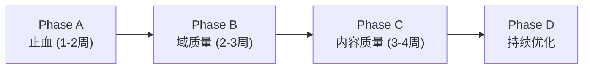

# Wiki 质量审计报告 (2026-06-01)

**数据源**: FalkorDB 生产环境 (via `scripts/audit_wiki_data.py`)
**范围**: 93 pages (28 domain_overview + 45 topic + 20 module_overview)
**审计方式**: 4维度多subagent深度审阅 + 2维度pipeline根因分析

---

## 执行摘要

| 维度 | P0 | P1 | P2 |
|------|-----|-----|-----|
| 标题/命名 | 3 | 2 | 1 |
| 内容质量 | 3 | 4 | 2 |
| 域划分/架构 | 1 | 3 | 1 |
| 信息准确性 | 3 | 2 | 3 |
| **合计** | **10** | **11** | **7** |

---

## P0 问题清单（必须修复）

### P0-1 复合序列标题（18/45 topic = 40%）

**现象**: Topic标题使用 `中文名（domain-slug·专题·N）` 格式
- 示例: "评分弹窗核心服务（app-store-rating-popup·专题·1）"
- 示例: "在线状态核心服务（quick-message·专题·1）"

**根因链**:
1. `domain_doc_agent._extract_chunk_title` → 无差异化标题
2. `content_guards.derive_semantic_title` → 回退为 `{域名}服务`
3. `finalize._deduplicate_exact_titles` → 追加 `（slug·专题·N）`

**修复方向**: derive_semantic_title 传入 summaries；finalize 禁止 slug 进入用户可见 title

---

### P0-2 跨域语义错配

**现象**: `quick-message` 域的 display_name 为"在线状态"，3个页面标题含"在线状态"
- Path: `/__domains__/quick-message/...` 但标题"在线状态核心服务"
- `intimacy-task-execution` 域混入家族/挚友模块

**根因**: LLM 命名后无 slug↔display_name 语义一致性校验

**修复方向**: `graph_domain_namer.py` 新增 slug-display 对齐验证

---

### P0-3 重复域

**现象**: 2组完全重复的域
- `relation-rank` vs `relation-rank-service` (各3页，overview标题完全相同)
- `quick-message` vs `quick-message-service`

**根因**:
- stem merge 仅在同 batch 内生效（`_dedup_parallel_naming_results` Pass 2）
- 跨 batch/层级不合并
- LLM merge 默认被 skip (`skip_llm_merge_when_corrector_enabled=True`)

**修复方向**: 全局 stem-suffix domain merge + 启用 LLM merge

---

### P0-4 页面标题与内容完全错绑

**现象**: `DeviceInfoDTO` 标题但内容描述的是亲密任务执行模块

**根因**: mechanical split 时类名成为 title，agent 写了域内其他内容，finalize 未校验

**修复方向**: quality_gate 新增 title-content 一致性检查

---

### P0-5 编造 Java 伪代码（~42/45 topic）

**现象**: Topic 页含大量伪 Java 方法(`shouldShowPopup()`, `validateInviteEligibility()`)
- 与同域 overview 中真实 API 互相矛盾
- `code_block_verifier` 标记 `<!-- UNVERIFIED_CODE -->` 但不删除

**根因**:
- `page_agent.write()` 无工具约束，LLM 自由生成
- `code_block_verifier` 仅标记，`finalize` 剥注释留代码
- `citation_verifier` 只看 PascalCase，camelCase 方法名绕过

**修复方向**: unverified 代码块强制删除或替换为 CONTEXT_GAP

---

### P0-6 Module Overview 无 graph backing 仍输出长文

**现象**: 20/20 module_overview 页显示 `_No nested graph children_` 但仍 3000-5000 字

**根因**:
- `composer.compose_page()` 无条件走 tier2 LLM
- quality_gate 对 module_overview 无长度/graph 密度检查
- enrichment 对空 graph 仍追加 4 节

**修复方向**: graph_score=0 时强制 tier3/skeleton，禁止 tier2+enrichment

---

### P0-7 确定性幻觉

**现象**:
- `FamilyInfoChangeEvent`: 编造 P95<200ms、事件数据≤1KB
- `ClosedFriendStatusEnum`: 无定义却输出完整状态机 + 虚构状态码
- `BaseUserShowDTO`: 自述"术语表无此类"仍编造 builder/继承树

**根因**: quality_gate 对 hallucination 仅 soft warning；state 图 LLM 编造无实体验证

**修复方向**: HARD_REJECT_FLAGS 立即拒稿；enum 无 AST 值时禁止 stateDiagram

---

## P1 问题清单（重要改进）

| # | 问题 | 影响 | 修复方向 |
|---|------|------|----------|
| P1-1 | 过度碎片化 (28 leaf域，11仅1页) | 导航混乱 | domain_budget 降至18 + 小域合并 |
| P1-2 | 语义重叠域 (亲密×5, 家族×5) | 概念混淆 | CJK bigram+embedding 双阈值 merge |
| P1-3 | 模板同质化 (96%+ 固定H2) | 阅读疲劳 | 模板分级 T0/T1/T2 |
| P1-4 | Enum/常量过度文档化 (4000字/枚举) | 噪音淹没 | entity_filter → MERGE_TO_PARENT |
| P1-5 | Module Overview 英文H2 (cn=0.325) | 语言割裂 | 中文化模板 + cn_ratio gate |
| P1-6 | 装饰性Mermaid (~80% module) | 信息密度低 | 节点实体对齐校验 |
| P1-7 | 导航层次缺失 | 无法感知父子 | page metadata parent/breadcrumb |
| P1-8 | Domain overview 标题含 slug | 技术暴露 | finalize 禁止 slug 出现在标题 |
| P1-9 | 内容与 overview 矛盾 | 可信度低 | 跨页一致性校验 |
| P1-10 | 示例阈值无配置锚点 | 误导运营 | 数字必须引用 Config 常量 |
| P1-11 | fluff 禁词未生效 | 水文泛滥 | 硬门禁 fluff > 5 |

---

## P2 问题清单（待观察）

| # | 问题 |
|---|------|
| P2-1 | `business_domain` 空值 (20/20 module_overview) |
| P2-2 | 空白 graph 占位段 (`_No nested graph children_`) |
| P2-3 | domain/topic 内容重叠 (Jaccard > 0.3) |
| P2-4 | 机械命名但未触发消歧的 topic (27页含"核心服务") |
| P2-5 | domain 内 cn_ratio 波动大 |
| P2-6 | Mermaid participant 全英文无中文别名 |
| P2-7 | 英文术语首次出现无中文释义 |

---

## Pipeline 修复路线图



### Phase A: 止血（优先级最高）
1. 伪代码 hard strip（code_block_verifier → 删除而非标记）
2. SLA/状态图 hard reject
3. 全局 stem-suffix domain merge
4. 空 graph module 禁止 tier2

### Phase B: 域质量
5. slug↔display 一致性校验
6. 启用 LLM domain merge
7. 亲密/家族域合并（28→~16域）
8. Topic 标题语义化 + finalize 禁 slug

### Phase C: 内容质量
9. 模板分级 (T0/T1/T2)
10. Enum/常量 merge-to-parent
11. Module 中文化 + cn_ratio gate
12. Mermaid 实体对齐验证

### Phase D: 持续优化
13. 导航 breadcrumb
14. 跨页一致性校验
15. H2 多样性检测

---

## 数据快照

```
总页面: 93 (domain_overview: 28, topic: 45, module_overview: 20)
内容长度: min=2857, median=4923, max=9144
CN ratio: min=0.240, median=0.420, max=0.601
H2平均: 5.5 sections/page
Mermaid覆盖: 100% (93/93)
幻觉标记: 1页自动检出，实际≥5页确认
复合标题: 18/45 topic (40%)
空graph module: 20/20 (100%)
重复域: 2组
单页域: 11/28 (39%)
```

---

## 与上次审计 (V13) 对比

| 指标 | V13 | 当前 | 变化 |
|------|-----|------|------|
| 复合序列标题 | ~60% | 40% | ↓ (F3 H2消歧生效) |
| 重复域 | 3组 | 2组 | ↓ (F1 stem merge部分生效) |
| 幻觉检出 | 0 | 1 | ↑ (检测规则增强) |
| module_overview cn | — | 0.325 | 首次度量 |
| 空 graph 长文 | — | 20/20 | 首次识别 |

---

## 附注

- 审计时间: 2026-06-01 19:42 CST
- Pipeline 版本: 含 V14 + Tier1 (G4/G5/N1) + Tier2 (G6/N2/G8) 全部修复
- 数据生成时间跨度: 2026-05-18 ~ 2026-06-01
